# 온길 Data Model & ERD

> 버전: v1.1 | 작성일: 2026-07-07 | 최종 개정: 2026-07-09 (CLAUDE.md 변경 이력 참조)
> 기술 스택: Supabase (PostgreSQL) + Prisma ORM + RLS

---

## 1. ERD 다이어그램 (Mermaid)

```mermaid
erDiagram
    USERS {
        uuid id PK
        text email UK
        text role "person|guardian|supporter|teacher|social_worker|therapist"
        text full_name
        text avatar_url
        timestamptz created_at
        timestamptz updated_at
    }

    PERSONS {
        uuid id PK
        uuid primary_guardian_id FK
        text full_name
        date birth_date
        text gender "M|F|other"
        text[] disability_types
        text disability_degree "severe|mild"
        jsonb emergency_info
        text avatar_url
        bool is_adult
        timestamptz created_at
        timestamptz updated_at
    }

    GUARDIANS {
        uuid id PK
        uuid user_id FK
        uuid person_id FK
        bool is_primary
        timestamptz created_at
    }

    PERMISSIONS {
        uuid id PK
        uuid person_id FK
        uuid grantee_id FK "users.id"
        text domain "MED|EDU|WEL|DAI|TRA|LEG"
        text access_level "read|write|edit"
        bool is_active
        date valid_from
        date valid_until
        uuid granted_by FK "users.id"
        timestamptz created_at
        timestamptz updated_at
    }

    PERMISSION_LOGS {
        uuid id PK
        uuid permission_id FK
        text action "grant|revoke|update"
        uuid actor_id FK "users.id"
        jsonb before_state
        jsonb after_state
        timestamptz created_at
    }

    RECORDS {
        uuid id PK
        uuid person_id FK
        uuid author_id FK "users.id"
        text domain "MED|EDU|WEL|DAI|TRA|LEG"
        text record_type "EDU-001|DAI-002|MED-006|..."
        jsonb content
        bool is_draft
        bool is_milestone
        bool is_pinned
        text[] tags
        timestamptz record_date
        bool requires_confirmation
        uuid confirmer_id FK "users.id"
        timestamptz confirmed_at
        timestamptz created_at
        timestamptz updated_at
    }

    RECORD_ATTACHMENTS {
        uuid id PK
        uuid record_id FK
        text file_name
        text file_url
        text mime_type
        int file_size
        uuid uploaded_by FK "users.id"
        timestamptz created_at
    }

    CONSENTS {
        uuid id PK
        uuid user_id FK
        text consent_type "terms|privacy|marketing|sensitive|unique_id"
        bool is_agreed
        bool on_behalf
        uuid on_behalf_of FK "persons.id"
        text version
        text ip_address
        timestamptz agreed_at
        timestamptz revoked_at
    }

    ACCESS_LOGS {
        uuid id PK
        uuid actor_id FK "users.id"
        uuid person_id FK
        uuid record_id FK
        text action "view|create|update|delete|export"
        text domain
        text ip_address
        text user_agent
        timestamptz accessed_at
    }

    HANDOVER_NOTES {
        uuid id PK
        uuid person_id FK
        uuid from_user_id FK "users.id"
        uuid to_user_id FK "users.id"
        text content
        text priority "high|normal|low"
        timestamptz acknowledged_at
        timestamptz created_at
    }

    NOTIFICATIONS {
        uuid id PK
        uuid recipient_id FK "users.id"
        text type "record_new|permission_grant|handover|reminder|record_confirm"
        text title
        text body
        jsonb data
        bool is_read
        timestamptz sent_at
        timestamptz read_at
    }

    NOTIFICATION_PREFERENCES {
        uuid id PK
        uuid user_id FK "users.id"
        text type "record_new|permission_grant|handover|reminder|record_confirm"
        bool fcm_enabled
        bool email_enabled
        timestamptz updated_at
    }

    USERS ||--o{ GUARDIANS : "is guardian"
    USERS ||--o{ PERMISSIONS : "granted to (grantee)"
    USERS ||--o{ RECORDS : "authors"
    USERS ||--o{ RECORDS : "confirms"
    USERS ||--o{ ACCESS_LOGS : "actors"
    USERS ||--o{ CONSENTS : "owns"
    USERS ||--o{ HANDOVER_NOTES : "from/to"
    USERS ||--o{ NOTIFICATIONS : "receives"
    USERS ||--o{ NOTIFICATION_PREFERENCES : "sets"

    PERSONS ||--o{ GUARDIANS : "has guardians"
    PERSONS ||--o{ PERMISSIONS : "has permissions"
    PERSONS ||--o{ RECORDS : "has records"
    PERSONS ||--o{ ACCESS_LOGS : "is subject of"
    PERSONS ||--o{ CONSENTS : "on behalf of"
    PERSONS ||--o{ HANDOVER_NOTES : "about"

    RECORDS ||--o{ RECORD_ATTACHMENTS : "has attachments"
    PERMISSIONS ||--o{ PERMISSION_LOGS : "has history"
```



---

## 2. 테이블 상세 스키마

### 2-1. users

```sql
CREATE TABLE users (
  id             uuid PRIMARY KEY DEFAULT gen_random_uuid(),
  email          text UNIQUE NOT NULL,
  role           text NOT NULL CHECK (role IN ('person','guardian','supporter','teacher','social_worker','therapist')),
  full_name      text NOT NULL,
  avatar_url     text,
  fcm_token      text,
  -- 계정 비활성화(동의 전체철회 + 탈퇴) 시각. NULL이면 활성. 행 삭제 대신 이 값으로 표현한다.
  -- 구현: 20260714020000_p2_privacy_settings. 본인만 UPDATE 가능(컬럼 레벨 GRANT, §2-1 하단 참조).
  deactivated_at timestamptz,
  -- F-AUTH-02 소셜 OAuth (설계 2026-07-15, 마이그레이션은 후속 라운드 — 아래 3개 컬럼은 아직 미구현)
  auth_provider  text NOT NULL DEFAULT 'email'
                 CHECK (auth_provider IN ('email','kakao','naver')),
  oauth_subject  text,           -- provider 고유 ID(kakao sub / naver id). email 가입은 NULL
  email_verified boolean NOT NULL DEFAULT true,  -- OAuth 이메일 미제공 시 placeholder면 false
  created_at     timestamptz DEFAULT now(),
  updated_at     timestamptz DEFAULT now(),
  -- 동일 provider 내 고유 식별자 유일성. email 가입(oauth_subject IS NULL)에는 적용 안 됨
  CONSTRAINT users_provider_subject_unique UNIQUE (auth_provider, oauth_subject)
);

-- 소셜 계정 조회 인덱스 (로그인 시 (auth_provider, oauth_subject) 정확 일치 조회)
CREATE INDEX idx_users_oauth ON users (auth_provider, oauth_subject)
  WHERE oauth_subject IS NOT NULL;
```

> **F-AUTH-02 스키마 변경안 주석** (설계만 — 실제 마이그레이션 미적용)
> - **계정 동일성 신뢰 소스**는 `email`이 아니라 `(auth_provider, oauth_subject)`다. 소셜 이메일이 기존 이메일 계정과 일치해도 자동 연결(account linking)하지 않는다 — 탈취 방지(`01-prd.md` §5-1-1).
> - `email UNIQUE NOT NULL`은 유지한다. 카카오·네이버 이메일 미제공 시 provider ID 기반 placeholder(`kakao_<sub>@oauth.ongil.local`)로 채우고 `email_verified=false`로 표시한다.
> - `UNIQUE (auth_provider, oauth_subject)`: PostgreSQL은 UNIQUE에서 NULL을 서로 다른 값으로 취급하므로 `auth_provider='email'`(oauth_subject NULL) 다중 행이 제약에 걸리지 않는다.
> - **RLS 영향 없음**: 기존 `users` 정책은 `id = auth.uid()` 기준이라 provider 컬럼 추가는 정책 변경을 요구하지 않는다. 단, placeholder 이메일이 다른 화면(초대 invitee_email 매칭 등)의 이메일 비교 로직에 새는지 security-rls가 후속 검토.

### 2-2. persons (당사자)

```sql
CREATE TABLE persons (
  id                  uuid PRIMARY KEY DEFAULT gen_random_uuid(),
  primary_guardian_id uuid REFERENCES users(id) NOT NULL,
  full_name           text NOT NULL,
  birth_date          date NOT NULL,
  gender              text CHECK (gender IN ('M','F','other')),
  disability_types    text[],    -- ['지체장애', '발달장애', ...]
  disability_degree   text CHECK (disability_degree IN ('severe','mild')),
  emergency_info      jsonb,     -- { allergies, medications, contacts }
  avatar_url          text,
  is_adult            boolean DEFAULT false,
  created_at          timestamptz DEFAULT now(),
  updated_at          timestamptz DEFAULT now()
);
```

### 2-2-1. 생애주기 단계 (life_stage) — 계산 값, 별도 저장 안 함

> ⚠️ **정정 이력(2026-07-17, `20260717000000_p3_lifecycle_5stage` 마이그레이션)**: 생애주기를 기존 3단계(아동기/청소년 전환기/성년기)에서 실제 특수교육·장애복지 현장 구분에 맞춘 **5단계**로 확장했다. 성년 경계도 만 18세→**만 19세**로 상향(민법상 성년 기준 정합). 근거: `01-prd.md` §3-1, `07-lifecycle-record-permission-proposal.md`.

생애주기 단계(영유아기/아동기/청소년 전환기/성인기/노년기)는 `birth_date`로부터 매 조회 시 계산되는 **파생 값**이며, 별도 컬럼으로 저장하지 않는다. 단, 성인기 전환(만 19세)은 동의 주체 이관이라는 상태 변화를 수반하므로 `is_adult`만 Flow-SYS-05(cron)로 영속화한다.

```sql
CREATE OR REPLACE FUNCTION get_life_stage(p_birth_date date)
RETURNS text
LANGUAGE sql
STABLE
AS $$
  SELECT CASE
    WHEN date_part('year', age(p_birth_date)) >= 65 THEN 'senior'  -- 노년기
    WHEN date_part('year', age(p_birth_date)) >= 19 THEN 'adult'   -- 성인기 (기존 18→19)
    WHEN date_part('year', age(p_birth_date)) >= 13 THEN 'youth'   -- 청소년 전환기
    WHEN date_part('year', age(p_birth_date)) >= 6  THEN 'child'   -- 아동기 (기존 13이하→6~12)
    ELSE 'infant'                                                    -- 영유아기 (신규)
  END;
$$;

-- 조회 편의 뷰 (persons + 계산된 life_stage)
CREATE OR REPLACE VIEW persons_with_stage AS
SELECT p.*, get_life_stage(p.birth_date) AS life_stage
FROM persons p;
```

| life_stage | 연령 기준 | 저장 여부 | 관련 상태 필드 |
|---|---|---|---|
| `infant` (영유아기) | 만 0~5세 | 계산값 (뷰/함수) | — |
| `child` (아동기) | 만 6~12세 | 계산값 (뷰/함수) | — |
| `youth` (청소년 전환기) | 만 13~18세 | 계산값 (뷰/함수) | IEP 전환계획 섹션 활성화 트리거 |
| `adult` (성인기) | 만 19~64세 | **`is_adult` 컬럼에 영속화** (Flow-SYS-05, 기존 18→19세로 상향) | 동의 주체 보호자→본인 이관 |
| `senior` (노년기) | 만 65세 이상 | 계산값 (뷰/함수) — 동의 주체 변화 없음 | 노년기 진입 알림(`life_stage_senior`) |

> 프론트엔드(`apps/web/src/lib/lifecycle.ts`, `apps/mobile/src/lib/iep.ts`)는 이 SQL 함수를 직접 호출하지 않고 동일 경계값의 TS 구현(`computeLifeStage`)을 별도로 유지한다 — 두 구현은 반드시 같은 경계값을 써야 하며, 헬퍼 `isSelfConfirmingStage`(adult/senior)·`isPreTransitionStage`(infant/child)로 "본인 확인주체 여부"·"전환계획 잠금 여부" 판정을 일원화했다.

Prisma에서는 `life_stage`를 매핑하지 않고, 애플리케이션 레이어 또는 `$queryRaw`로 `get_life_stage()`를 호출하거나 위 뷰를 통해 조회한다(스키마 마이그레이션 불필요, 나이는 매일 바뀌므로 저장 컬럼화 시 배치 갱신이 필요해 계산값 방식이 더 단순함).

### 2-3. guardians (보호자-당사자 관계)

```sql
CREATE TABLE guardians (
  id          uuid PRIMARY KEY DEFAULT gen_random_uuid(),
  user_id     uuid REFERENCES users(id) ON DELETE CASCADE,
  person_id   uuid REFERENCES persons(id) ON DELETE CASCADE,
  is_primary  boolean DEFAULT false,
  created_at  timestamptz DEFAULT now(),
  UNIQUE(user_id, person_id)
);
```

### 2-4. permissions (접근 권한)

```sql
CREATE TABLE permissions (
  id            uuid PRIMARY KEY DEFAULT gen_random_uuid(),
  person_id     uuid REFERENCES persons(id) ON DELETE CASCADE,
  grantee_id    uuid REFERENCES users(id) ON DELETE CASCADE,
  domain        text NOT NULL CHECK (domain IN ('MED','EDU','WEL','DAI','TRA','LEG')),
  access_level  text NOT NULL CHECK (access_level IN ('read','write','edit')),
  is_active     boolean DEFAULT true,
  valid_from    date DEFAULT CURRENT_DATE,
  valid_until   date,         -- NULL = 무기한
  granted_by    uuid REFERENCES users(id),
  created_at    timestamptz DEFAULT now(),
  updated_at    timestamptz DEFAULT now(),
  UNIQUE(person_id, grantee_id, domain)
);
```

### 2-5. permission_logs (권한 변경 이력 — 불변)

```sql
CREATE TABLE permission_logs (
  id            uuid PRIMARY KEY DEFAULT gen_random_uuid(),
  permission_id uuid REFERENCES permissions(id),
  action        text NOT NULL CHECK (action IN ('grant','revoke','update')),
  actor_id      uuid REFERENCES users(id),
  -- 'user'(요청 컨텍스트, auth.uid() 존재) | 'system'(cron 배치, auth.uid() NULL).
  -- 구현: 20260715020000_p3_permission_logs_actor_type. log_permission_change() 트리거가
  -- 자동 판정 — 애플리케이션에서 직접 쓰지 않는다.
  actor_type    text NOT NULL DEFAULT 'user',
  before_state  jsonb,
  after_state   jsonb,
  created_at    timestamptz DEFAULT now()
);
-- INSERT only, no UPDATE/DELETE (불변 감사 로그)
```

### 2-6. records (기록 — 핵심 테이블)

```sql
CREATE TABLE records (
  id          uuid PRIMARY KEY DEFAULT gen_random_uuid(),
  person_id   uuid REFERENCES persons(id) ON DELETE CASCADE,
  author_id   uuid REFERENCES users(id),
  domain      text NOT NULL CHECK (domain IN ('MED','EDU','WEL','DAI','TRA','LEG')),
  record_type text NOT NULL,  -- 'SELF-001','DAI-002','EDU-001','MED-005','MED-006','MED-007','WEL-004','WEL-005','TRA-001'
  content     jsonb NOT NULL, -- 기록 유형별 구조화된 내용
  is_draft    boolean DEFAULT false,
  is_milestone boolean DEFAULT false,
  is_pinned   boolean DEFAULT false,  -- 응급정보 등 고정 카드
  tags        text[],
  record_date timestamptz DEFAULT now(),
  -- 확인(confirmation) — 승인/반려 아님, 단순 확인. handover_notes.acknowledged_at과 동일 패턴.
  requires_confirmation boolean DEFAULT false,        -- 제출 시 author가 설정(§4-6 기본값 가이드)
  confirmer_id          uuid REFERENCES users(id),    -- 확인 주체: life_stage='adult'면 본인, 아니면 주보호자
  confirmed_at          timestamptz,                  -- NULL = 미확인. 반려 개념 없음(재확인 요청만 가능)
  created_at  timestamptz DEFAULT now(),
  updated_at  timestamptz DEFAULT now()
);

CREATE INDEX idx_records_person_domain ON records(person_id, domain);
CREATE INDEX idx_records_person_date ON records(person_id, record_date DESC);
CREATE INDEX idx_records_type ON records(record_type);
-- 확인 대기 우선 정렬 (handover_notes의 idx_handover_to_user와 동일 패턴)
CREATE INDEX idx_records_pending_confirm ON records(confirmer_id, confirmed_at NULLS FIRST)
  WHERE requires_confirmation = true;
```

### 2-7. record_attachments

```sql
CREATE TABLE record_attachments (
  id          uuid PRIMARY KEY DEFAULT gen_random_uuid(),
  record_id   uuid REFERENCES records(id) ON DELETE CASCADE,
  file_name   text NOT NULL,
  file_url    text NOT NULL,  -- Supabase Storage path
  mime_type   text,
  file_size   int,
  uploaded_by uuid REFERENCES users(id),
  created_at  timestamptz DEFAULT now()
);
```

### 2-8. consents (동의 수집 — PIPA)

```sql
CREATE TABLE consents (
  id           uuid PRIMARY KEY DEFAULT gen_random_uuid(),
  user_id      uuid REFERENCES users(id) ON DELETE CASCADE,
  consent_type text NOT NULL CHECK (consent_type IN ('terms','privacy','marketing','sensitive','unique_id')),
  is_agreed    boolean NOT NULL,
  on_behalf    boolean DEFAULT false,     -- 대리 동의 여부
  on_behalf_of uuid REFERENCES persons(id), -- 대리 동의 대상
  version      text NOT NULL,            -- 약관 버전
  ip_address   text,
  agreed_at    timestamptz,
  revoked_at   timestamptz,
  created_at   timestamptz DEFAULT now()
);
```

### 2-9. access_logs (접근 로그 — 불변)

```sql
CREATE TABLE access_logs (
  id          uuid PRIMARY KEY DEFAULT gen_random_uuid(),
  actor_id    uuid REFERENCES users(id),
  person_id   uuid REFERENCES persons(id),
  record_id   uuid REFERENCES records(id),
  action      text NOT NULL CHECK (action IN ('view','create','update','delete','export')),
  domain      text,
  ip_address  text,
  user_agent  text,
  accessed_at timestamptz DEFAULT now()
);

CREATE INDEX idx_access_logs_person ON access_logs(person_id, accessed_at DESC);
CREATE INDEX idx_access_logs_actor ON access_logs(actor_id, accessed_at DESC);
-- INSERT only
```

### 2-10. handover_notes (인수인계)

```sql
CREATE TABLE handover_notes (
  id              uuid PRIMARY KEY DEFAULT gen_random_uuid(),
  person_id       uuid REFERENCES persons(id) ON DELETE CASCADE,
  from_user_id    uuid REFERENCES users(id),
  to_user_id      uuid REFERENCES users(id),
  content         text NOT NULL,
  priority        text DEFAULT 'normal' CHECK (priority IN ('high','normal','low')),
  acknowledged_at timestamptz,
  created_at      timestamptz DEFAULT now()
);

CREATE INDEX idx_handover_to_user ON handover_notes(to_user_id, acknowledged_at NULLS FIRST);
```

### 2-11. notifications (알림)

```sql
-- type은 text+CHECK가 아니라 실제로는 Postgres ENUM 타입 NotificationType으로 구현되어 있다
-- (notification_preferences.type과 공용). 최초 5개 값에서 시작해 이후 두 라운드에 걸쳐
-- ALTER TYPE ... ADD VALUE로 4개가 추가되어 현재 9개 값이다:
--   record_new, permission_grant, handover, reminder, record_confirm (init, 20260709035541)
--   life_stage_youth, life_stage_adult (20260714000000_p2_life_stage_transitions)
--   permission_expiry_warning, permission_audit_summary (20260715010000_p3_permission_expiry_batch)
CREATE TYPE notification_type AS ENUM (
  'record_new','permission_grant','handover','reminder','record_confirm',
  'life_stage_youth','life_stage_adult',
  'permission_expiry_warning','permission_audit_summary'
);

CREATE TABLE notifications (
  id           uuid PRIMARY KEY DEFAULT gen_random_uuid(),
  recipient_id uuid REFERENCES users(id) ON DELETE CASCADE,
  type         notification_type NOT NULL,
  title        text NOT NULL,
  body         text,
  data         jsonb,
  is_read      boolean DEFAULT false,
  sent_at      timestamptz DEFAULT now(),
  read_at      timestamptz
);

CREATE INDEX idx_notifications_recipient ON notifications(recipient_id, is_read, sent_at DESC);
```

### 2-11-1. notification_preferences (알림 채널 설정)

`04-workflow.md` Flow-SYS-03에서 참조하는 테이블이지만 그동안 스키마가 정의되지 않았던 부분을 보완한다. 사용자별·알림 유형별로 채널을 켜고 끌 수 있게 한다.

```sql
CREATE TABLE notification_preferences (
  id         uuid PRIMARY KEY DEFAULT gen_random_uuid(),
  user_id    uuid REFERENCES users(id) ON DELETE CASCADE,
  type       notification_type NOT NULL,  -- §2-11의 9개 값 enum과 공용(별도 CHECK 없음)
  fcm_enabled   boolean DEFAULT true,
  email_enabled boolean DEFAULT true,
  updated_at timestamptz DEFAULT now(),
  UNIQUE(user_id, type)
);
```

- 행이 없으면 기본값(둘 다 `true`)으로 간주 — 신규 가입자가 매 타입마다 명시적으로 행을 만들 필요 없음.
- Flow-SYS-03에서 "알림 대상 사용자 조회" 단계는 이 테이블에서 `type`에 맞는 채널이 꺼져 있으면 해당 채널 발송을 건너뛴다(둘 다 꺼져 있어도 `notifications` 테이블 INSERT 자체는 항상 수행 — 인앱 알림 목록에는 남는다).

### 2-12. invitations (이해관계자 초대)

`04-workflow.md` Flow-1(이해관계자 초대 수락)이 요구하지만 기존 스키마에 없던 테이블을 보완한다. 보호자가 권한 부여 위저드(F-G-05 / G-32)에서 이해관계자(활동지원사·교사·사회복지사·치료사)를 초대할 때 생성되며, 초대받은 사람이 A-06에서 수락하면 `domain_grants`가 `permissions` 행으로 전개된다.

```sql
CREATE TABLE invitations (
  id             uuid PRIMARY KEY DEFAULT gen_random_uuid(),
  token          uuid NOT NULL DEFAULT gen_random_uuid() UNIQUE, -- 추측 불가 비밀값, 초대 링크에 포함
  person_id      uuid REFERENCES persons(id) ON DELETE CASCADE,  -- 어느 당사자에 대한 권한인지
  inviter_id     uuid REFERENCES users(id) ON DELETE SET NULL,   -- 초대한 보호자
  invitee_email  text NOT NULL,                                  -- 초대 대상 이메일
  role           text NOT NULL CHECK (role IN ('guardian','supporter','teacher','social_worker','therapist')),
  domain_grants  jsonb NOT NULL,   -- [{ domain: 'EDU', access_level: 'write' }, ...] — 수락 시 permissions로 전개
  valid_until    date,             -- 부여될 권한의 만료일(NULL = 무기한)
  status         text NOT NULL DEFAULT 'pending' CHECK (status IN ('pending','accepted','declined','expired')),
  accepted_at    timestamptz,
  accepted_by    uuid REFERENCES users(id) ON DELETE SET NULL,
  created_at     timestamptz DEFAULT now()
);

CREATE INDEX idx_invitations_email ON invitations(invitee_email);
-- token은 UNIQUE 제약이 인덱스를 겸하므로 별도 인덱스를 두지 않는다.
```

- `role`은 당사자(person)를 제외한 초대 가능한 5개 역할만 허용하므로 `UserRole` enum을 재사용하지 않고 `CHECK` 제약이 있는 `text`로 둔다(`permission_presets.role`과 동일 선례). `status`는 닫힌 4값 집합이라 Prisma에서 `InvitationStatus` enum으로 매핑한다.
- **수락 전개는 `accept_invitation(p_token uuid)` SECURITY DEFINER 함수로 처리한다.** `permissions`의 INSERT는 주보호자만 허용되므로(§4-3) 초대받은 이해관계자는 자기 권한을 직접 만들 수 없다. 함수는 (1) 호출자 이메일 = `invitee_email`, (2) `status='pending'`, (3) 미만료를 검증한 뒤에만 `domain_grants`를 `permissions`로 전개하고 `status='accepted'`로 갱신한다.

### 2-13. invitations RLS

RLS 정책·GRANT의 신뢰 소스는 security-rls의 `20260710000000_p0_7_consents_invitations_rls` 마이그레이션(§4-8)이다. 요지는 **authenticated 한정**이다:

- **SELECT**: `inviter_id = auth.uid()` OR `invitee_email = 로그인 사용자 이메일`. **`anon`에는 아무 권한도 주지 않는다.**
  - ⚠️ 초기 설계에서 검토한 `USING (true)` + anon GRANT는 폐기했다. RLS의 `USING`은 행 필터일 뿐 "쿼리가 반드시 `token`으로 필터링하도록 강제"하지 못하므로, anon이 `SELECT * FROM invitations`로 테이블 전체(모든 `invitee_email`·`domain_grants`)를 덤프할 수 있어 PIPA상 실사용 불가였다.
  - 미가입자가 A-06에서 토큰으로 초대를 미리 보는 경로는 RLS를 우회하는 **service-role 클라이언트**(`apps/web/src/lib/supabase/service-role.ts`)로 처리하며, 호출부에서 `token` 정확 일치 단일 행만 조회한다(`getInvitationByToken`). token이 애플리케이션 코드 경로의 필수 입력이라 테이블 덤프가 불가능하다.
- **INSERT**: `inviter_id = auth.uid()` AND 호출자 역할이 `guardian`.
- **UPDATE**: 초대받은 본인(이메일 일치) + `pending → accepted|declined` 전이만 허용. 수락 시 `permissions` 전개는 `accept_invitation()` SECURITY DEFINER 함수가 담당(권한 INSERT가 주보호자 전용이라 우회 필요). 거절은 권한 전개가 없으므로 별도 함수 없이 이 UPDATE 정책에 기대어 서버 액션에서 직접 갱신한다.

---

## 3. record_type별 content JSONB 스키마

### SELF-001 — 당사자 자기표현

```typescript
{
  mood: 'good' | 'neutral' | 'sad' | 'angry',
  meal: 'full' | 'partial' | 'none',
  meal_photo_url?: string,
  activities: ('exercise' | 'study' | 'craft' | 'social')[],
  health: 'good' | 'sick' | 'tired',
  memo?: string,
  voice_url?: string,
}
```

### DAI-002 — 활동지원 일지

```typescript
{
  service_date: string,          // YYYY-MM-DD
  start_time: string,            // HH:MM
  end_time: string,              // HH:MM
  scheduled_hours?: number,      // 계획(사전 일정) 시간 — 사전 일정이 없을 수도 있어 optional
  service_hours: number,         // 실적 시간 — 서버가 start/end로 자동 재계산해 저장
  activities: { category: string, minutes: number }[],
  health_status: 'good' | 'sick' | 'tired',
  meal_status: 'full' | 'partial' | 'none',
  incidents?: string,
  handover_note?: string,
  reference_journal_id?: string, // 이전 일지 참조
}
```

- 활동지원 실무는 **"일정표(사전계획)"와 "제공기록지(사후실적)"**를 구분한다(docs/07 §5 갭④). `scheduled_hours`는 계획 시간(사전 일정이 없으면 생략), `service_hours`는 서버가 `start_time`/`end_time`으로 재계산하는 실제 제공(실적) 시간이다 — 두 값은 의미가 다르므로 혼용하지 않는다. `service_hours` 필드명은 이미 저장된 DAI-002 레코드(목업 포함)와의 하위호환을 위해 유지한다(개명 금지).

### EDU-001 — IEP (개별화교육계획)

```typescript
{
  school: string,
  academic_year: string,
  meeting_date: string,
  participants: string[],
  current_levels: {
    korean: string, math: string, social: string,
    communication: string, self_care: string
  },
  annual_goals: {
    area: string,
    goal: string,
    short_term_goals: { goal: string, period: string, evaluation: string }[],
  }[],
  support_services: { service: string, provider: string, frequency: string }[],
  transition_plan?: { goal: string, steps: string[] },
}
```

- `annual_goals[]`의 `achievement_rate`(0~100)와 `evaluation_note`는 §3 원안에 없던 **선택 확장 필드**다(P2-1 T-14 추가). 작성(T-13) 시엔 없다가 T-14 인라인 점검에서 채워지며, 없으면 미평가로 간주한다. T-01 카드의 달성률 평균은 채워진 `achievement_rate`만 집계한다.

### EDU-002 — 관찰기록 (특수교사, P2-1 T-16)

```typescript
{
  observedAt: string,        // ISO datetime (관찰 일시). record_date로도 사용
  situation: string,         // 관찰 상황 (예: '3교시 국어 모둠 활동')
  tags: string[],            // 행동/언어/사회성/학습 4개 카테고리의 태그 값(복수). records.tags 컬럼에도 동일 저장
  note: string,              // 관찰 내용 (1~3000자)
  linkedGoalArea?: string,   // T-14에서 연결한 IEP 목표 영역 라벨(느슨한 문자열 매칭, FK 아님)
}
```

- 특수교사가 작성하는 일상 관찰 기록(F-T-03). `domain='EDU'`, `requires_confirmation=false`(§4-6 일상 기록 — 확인 절차 없음).
- EDU-001(snake_case)과 달리 **camelCase 키**를 쓴다 — `linkedGoalArea`는 T-14 "관찰기록 연결" 패널에서 IEP 목표(`annual_goals[].area` 또는 `"영역 · 목표"` 라벨)와 문자열로 느슨하게 매칭하는 키이며 FK가 아니다. 태그 카탈로그(4카테고리×4)는 `@ongil/validation`의 `OBSERVATION_TAG_CATALOG` 상수로 프론트·검증이 공유한다.

### EDU-003 — 행동중재계획 BIP (특수교사, docs/07 §5 갭③)

```typescript
{
  target_behavior: string,         // 중재 대상 행동 (1~2000자)
  behavior_function:               // 행동의 기능(기능평가 FBA 4분류)
    'attention' | 'escape' | 'sensory' | 'other',  // 관심획득/회피/감각추구/기타
  fba_basis?: ('observation' | 'guardian_interview' | 'teacher_interview' | 'checklist')[],  // 기능평가 근거(복수선택, optional)
  antecedent_strategies: string,   // 선행사건 중재 전략 (1~3000자)
  replacement_behavior: string,    // 대체행동 (1~2000자)
  reinforcement_plan: string,      // 강화 계획 (1~3000자)
  crisis_procedure?: string,       // 위기상황 대응절차 (optional, ≤3000자)
  review_date: string,             // 재검토 예정일 YYYY-MM-DD
}
```

- 특수교사(`teacher`)가 작성하는 **행동중재계획(Behavior Intervention Plan)**. `domain='EDU'`, `requires_confirmation=true` — IEP·ISP·치료계획서와 동일한 **공식 지원계획 문서** 분류(§4-6①)라 제출 시 `trg_assign_confirmer`가 확인 주체(성년=본인, 미성년=주보호자)를 자동 지정한다.
- 스키마 스타일은 동급 공식 문서 EDU-001(IEP)의 **snake_case**를 따른다(일상 관찰 기록 EDU-002의 camelCase와 구분). `crisis_procedure`만 optional — 위기대응 절차가 불필요한 경도 사례를 허용한다. `behavior_function`은 기능평가(FBA) 관행의 4대 분류다.
- **`fba_basis`(2026-07-17 추가, `docs/08-record-taxonomy-workshop.md` 안건2-1):** 별도 FBA record_type(EDU-004 후보)을 신설하는 대신, `behavior_function` 판정의 근거 자료 유형(관찰기록/학부모면담/교사면담/체크리스트, 복수선택)을 BIP 자체에 선택 필드로 흡수했다. optional이라 마이그레이션 불필요, 기존 레코드도 하위호환.

### EDU-005 — 개별화전환계획 ITP (특수교사, docs/08-record-taxonomy-workshop.md 안건2-2 신설)

```typescript
{
  career_interest_areas: string[],   // 진로 흥미영역(자유 텍스트, 1개 이상)
  work_experience_log: {
    activity: string,                // 실습/체험 활동명
    period: { start: string, end: string },
    note?: string,                   // 비고 (선택, ≤1000자)
  }[],
  next_step_note?: string,           // 성인기 인계 메모 (선택, ≤2000자)
  next_review_date: string,          // 다음 검토일 YYYY-MM-DD
}
```

- 특수교사(`teacher`)가 작성하는 **학교 단위 개별화전환계획(Individual Transition Plan)**. `domain='EDU'`, `requires_confirmation=true` — IEP·BIP와 동급의 공식 지원계획 문서(§4-6①)라 제출 시 `trg_assign_confirmer`가 확인 주체(성년=본인, 미성년=주보호자)를 자동 지정한다.
- **활성 단계는 청소년 전환기(만 13~18세)만** — `isItpActiveStage()` 헬퍼(앱 레이어, `apps/web/src/lib/lifecycle.ts`)로 서버·UI 양쪽에서 강제한다. TRA-001(사회복지사, 성인기까지 이어지는 "실행" 로드맵)과는 활성 구간이 다르고 별개 레코드다 — `person_id`로만 느슨하게 연결(FK 없음, TRA-001↔EDU-001.transition_plan과 동일 관행). TRA-001 작성 화면은 `getLatestItpSummary(personId)`로 이 당사자의 최근 ITP를 참고용 소프트 링크로 보여준다.
- PM 합의(워크숍 안건2-2 "범위 최소화")에 따라 최소 스키마로 시작 — 진로 흥미영역·현장실습 이력·인계메모·다음 검토일 4필드.
- RLS·`permission_presets` **변경 없음** — 특수교사는 이미 EDU domain edit 프리셋을 보유하며, `records_select/insert/update`(§4-2)는 `record_type`을 참조하지 않으므로 그대로 커버된다(라이브 DB 정책 SQL 직접 대조로 확인 완료).

### MED-005 — 치료계획서

```typescript
{
  plan_period: { start: string, end: string },
  diagnosis: string,
  therapy_type: 'physical' | 'occupational' | 'speech' | 'psychological' | 'other',
  goals: {
    area: 'physical' | 'language' | 'cognitive' | 'social',
    long_term: string,
    short_term: string,
    target_score?: number,          // 0-100, 평가보고서(MED-007) domain_scores와 비교 기준
  }[],
  session_frequency: string,        // 예: '주 2회'
  responsible_therapist: string,
  precautions?: string,
}
```

### MED-006 — 회기 일지

```typescript
{
  session_date: string,
  therapy_plan_id: string,        // 연결된 치료계획서 ID
  session_number: number,
  planned_goals: string[],
  actual_progress: string,
  domain_scores: {
    physical: number,             // 0-100
    language: number,
    cognitive: number,
    social: number,
  },
  observations: string,
  next_session_plan?: string,
}
```

### MED-007 — 평가보고서

```typescript
{
  eval_type: 'initial' | 'interim' | 'final',
  eval_date: string,
  therapy_plan_id: string,          // 연결된 치료계획서(MED-005) ID
  domain_scores: {
    domain: 'physical' | 'language' | 'cognitive' | 'social',
    score: number,                  // 0-100
  }[],
  summary: string,
  recommendations?: string,
}
```

- TH-17 "평가보고서 3열 비교 뷰"는 동일 `therapy_plan_id`를 공유하는 `eval_type: 'initial'|'interim'|'final'` 세 레코드를 조회해 화면에서 나란히 비교 렌더링한다(증감 `Δ`는 저장 값이 아니라 조회 시 계산).

### WEL-004 — ISP (개별지원계획)

```typescript
{
  service_period: { start: string, end: string },
  reassessment_date: string,
  case_manager: string,
  needs: { area: string, needs: string, barriers: string }[],
  goals: {
    area: string,
    long_term: string,
    short_term: string,
    responsible: string,
    deadline: string,
    achievement_rate: number,
  }[],
  services: {
    service: string, provider: string, frequency: string, start: string
  }[],
}
```

### WEL-005 — 서비스 이용계획

```typescript
{
  services: {
    service_name: string,
    provider: string,
    frequency: string,
    start_date: string,
    end_date?: string,
    status: 'active' | 'paused' | 'ended',
  }[],
  monthly_cost?: number,
  funding_source?: string,          // 예: '발달재활서비스 바우처'
  case_manager: string,
  next_review_date: string,
}
```

- W-17 "서비스 이용 현황"(ST-07)은 `person_id` 기준 `WEL-005` 레코드의 `services[]`를 표 형태로 렌더링하고, `status`로 필터링한다.

### WEL-006 — 사례회의록 (social_worker, docs/08-record-taxonomy-workshop.md 안건2-3 신설)

```typescript
{
  meetingDate: string,       // ISO datetime — 회의 일시. record_date로도 사용
  participants: string[],   // 참석자 목록(자유 텍스트, 쉼표 구분 입력)
  discussion: string,       // 논의 내용 (1~3000자)
  decisions?: string,       // 결정사항 (선택, ≤2000자)
}
```

- 사회복지사가 작성하는 **사례회의록**(F-W 계열). ISP(WEL-004) 수립·재사정 시 다직종 사례회의의 논의 내용·결정사항을 남긴다 — ISP는 최종 결과만 담고 논의 과정 자체가 남지 않는다는 갭(온길 권한 매트릭스 Artifact §08)을 메운다.
- `domain='WEL'`, `requires_confirmation=false`(§4-6 — 관찰기록·권익옹호 상담기록과 동급의 일상 기록). EDU-002·LEG-002와 마찬가지로 확인 절차가 없는 일상 기록이라 **camelCase 키**를 쓴다.
- 위자드가 아니라 **단일 폼**으로 작성한다(워크숍 논의: "회의 중 빠르게 메모하듯 쓸 수 있어야 한다"). 저장 시 확인 절차 대신 당사자·보호자에게 **일반 알림(`record_new`)만** best-effort로 발송한다(`createCaseConferenceNote`).
- RLS·`permission_presets` **변경 없음** — `records_select/insert/update`(§4-2)는 `domain`·`access_level`만 참조하고 `record_type`을 전혀 보지 않으므로, 사회복지사가 이미 보유한 WEL write/edit 권한이 WEL-006에도 그대로 적용된다(라이브 DB 정책 SQL 직접 대조로 확인 완료).

### TRA-001 — 전환계획

```typescript
{
  roadmap_stage: 'exploration' | 'planning' | 'training' | 'employment',  // 탐색→계획→훈련→취업/자립
  career_goal: string,                // 희망 진로
  independent_living_plan?: string,   // 자립생활계획
  training_records: {
    program: string,
    provider: string,
    period: { start: string, end: string },
    status: 'planned' | 'ongoing' | 'completed',
  }[],
  linked_agencies?: string[],         // 연계 기관 (예: 발달장애인훈련센터, 지역 장애인복지관)
  case_manager: string,
  next_review_date: string,
}
```

- W-16 "전환계획 로드맵"(UIUX §7-5)은 `roadmap_stage` 값으로 `[탐색]→[계획]→[훈련]→[취업/자립]` 4단계 중 현재 위치를 마커로 표시한다.
- `EDU-001.transition_plan`(IEP 내 전환계획 서브섹션, 만 14세+ 조건부)과는 별개의 독립 레코드다 — IEP 쪽은 교육 목표 관점의 요약이고, TRA-001은 사회복지사가 작성하는 전환 로드맵 전체를 관리한다. 두 레코드 간 명시적 FK는 없으며 같은 `person_id`로만 연결된다.

### GEN-001 — 보호자 범용 기록 (G-21)

```typescript
{
  title: string,   // 1~200자
  body: string,    // 1~5000자
}
```

- 보호자(`guardians`)가 도메인 제한 없이 직접 작성하는 자유 형식 기록(F-G-04). 전문가가 만드는 구조화 기록(EDU-001/WEL-004 등)과 달리 `content`가 `{title, body}`로 단순하다. `domain`은 6개 도메인 중 작성 시 선택하며, `requires_confirmation=false`(보호자 본인 작성분은 확인 절차 대상 아님, §4-6).

### LEG-001 — 후견감독보고서 (social_worker, docs/07 §5 ① 갭 해소)

```typescript
{
  report_kind: 'initial' | 'periodic',  // 보고 구분(2026-07-17 추가) — 기본값 periodic
  report_period: { start: string, end: string },  // 보고 대상 기간 YYYY-MM-DD
  guardian_type: 'adult' | 'limited' | 'specific' | 'voluntary',  // 성년/한정/특정/임의후견
  guardian_name: string,               // 후견인 성명
  property_management_summary: string, // 재산관리 현황 요약 (1~3000자)
  personal_care_summary: string,       // 신상보호 현황 요약 (1~3000자)
  incidents?: string,                  // 특이사항 (선택)
  next_report_due: string,             // 다음 보고 예정일 YYYY-MM-DD
}
```

- 성년후견인이 정기적으로 법원에 제출하는 **후견감독보고서**를 사회복지사가 플랫폼에 기록한다(F-W 계열). `domain='LEG'`, `requires_confirmation=true`(§4-6 — IEP/ISP/치료계획서/전환계획과 동급의 법정·공식 서류). 제출(`is_draft:true→false`) 시 `trg_assign_confirmer`가 확인 주체(성인기·노년기=본인, 그 외=주보호자)를 자동 지정한다.
- 스키마 스타일은 동급 공식 문서인 WEL-004(ISP)·MED-005(치료계획서)의 **snake_case**를 따른다(`report_period` 객체 + `guardian_type` enum + 담당자 성명 + 서술 요약 2종 + optional 특이사항 + 다음 기한). `guardian_type` 4종은 민법상 후견 유형(성년/한정/특정/임의)이다.
- **`report_kind`(2026-07-17 추가, `docs/08-record-taxonomy-workshop.md` 안건2-4):** 별도 record_type(LEG-003 재산목록보고서 후보)을 신설하는 대신, 후견개시 직후 최초 1회 제출하는 재산목록보고(`initial`)와 정기 후견사무보고(`periodic`)를 판별 필드로 구분한다. 기본값 `periodic`이라 기존 레코드도 하위호환. RLS·권한 프리셋 변경 없음(LEG 도메인 단위 정책이 그대로 커버).

### LEG-002 — 권익옹호 상담기록 (social_worker, docs/07 §5 ① 갭 해소)

```typescript
{
  consultedAt: string,        // ISO datetime (상담 일시). record_date로도 사용
  issueType: 'rights_violation' | 'discrimination' | 'abuse_suspected' | 'other',  // 인권침해/차별/학대의심/기타
  content: string,            // 상담 내용 (1~3000자)
  actionTaken?: string,       // 취한 조치 (선택)
  referralAgency?: string,    // 연계 기관 (선택, 예: 지역 장애인권익옹호기관)
}
```

- 사회복지사가 작성하는 **권익옹호 상담 이력**(F-W 계열). `domain='LEG'`, `requires_confirmation=false`(§4-6 — 관찰기록·활동지원일지와 동급의 일상 기록, 확인 절차로 인한 알림 피로 방지).
- EDU-002(관찰기록)와 달리 스키마 스타일은 **camelCase 키**를 쓴다 — 확인 절차가 없는 일상 관찰성 기록의 유일한 선례(EDU-002)와 일관되게 맞춘 결정이다. `issueType` 4종은 권익옹호 실무의 상담 분류이며, `abuse_suspected`(학대의심)는 별도 신고 의무 판단의 트리거가 될 수 있으나 그 워크플로우는 이번 범위 밖이다.
- **구조화 기록의 보호자 편집(비파괴):** 보호자가 GEN-001이 아닌 구조화 기록을 G-21에서 "수정"할 때는 `content`를 `{title, body}`로 덮어쓰지 않는다. 원본 구조화 필드를 보존하기 위해 `content.guardianNote: { title, body, editedAt }` 서브키에 병합한다. 화면은 원본 구조화 내용을 보여주고 그 아래 "보호자 메모" 섹션만 편집 가능하게 노출한다. `content` 변경이므로 `requires_confirmation=true`였던 기록은 `trg_reset_confirmation_on_edit`(§4-6④)에 의해 재확인 대기로 되돌아간다.
- **연령 가드(2026-07-17 보완):** `docs/07` §4-4/§4-5에 따라 LEG는 성인기·노년기(만 19세 이상)부터 활성화되는데, LEG-001/002 최초 구현 시 이 가드가 `records/leg/actions.ts`에 빠져 있어 영유아기 당사자에게도 두 유형 모두 작성이 가능했다(qa-verifier 갭 분석으로 발견). TRA-001(`records/transition/actions.ts`의 `isPreTransitionStage`)과 동형으로 `createGuardianshipReport`/`createAdvocacyConsultation` 양쪽에 `isSelfConfirmingStage` 서버 재검증을 추가하고, 위자드·폼에도 동일한 "성인기 이전 차단" 배너를 넣어 해소했다.

---

## 4. RLS 정책

### 4-1. persons 테이블

> ⚠️ **정정 이력(2026-07-17, `p3_persons_select_permission_holders`):** 최초 정의(2026-07-09)는 주보호자·guardians 관계·당사자 본인 3분기만 있고 **permissions로 도메인 권한을 부여받은 전문가(교사/사회복지사/치료사/활동지원사) 분기가 없었다.** 그 결과 ① `getBipClients`/`getLegClients`/`getTransitionPlanClients`/`getIspClients`/`getItpClients` 등 "담당 당사자 목록" 조회가 `records_select`는 통과하지만 `persons_select`에서 막혀 **전문가에게 항상 빈 목록으로 보이는** 결함, ② `assign_record_confirmer()` 트리거(SECURITY INVOKER, §4-6)가 전문가 작성 기록 제출 시 내부 `persons` 조회를 못 해 **`confirmer_id`가 계속 NULL로 남아 확인요청 알림이 발송되지 않는** 결함이 있었다. 두 갭 모두 BIP·IEP·ISP·LEG·TRA·WEL-006 전부에 이미 존재하던 선재 아키텍처 갭으로, EDU-005(ITP) 신규 구현의 qa-verifier 검증 중 실제 `authenticated` 세션 시뮬레이션(라이브 로컬 Supabase, teacher1 계정)으로 처음 재현·발견됐다 — 이전 라운드들은 superuser/service-role 경로로만 확인해 이 갭을 놓쳤다. 아래는 수정 반영된 최종본이다.

```sql
-- 당사자 본인·보호자·활성 permissions 보유 전문가(도메인 무관, read 이상)만 SELECT
CREATE POLICY persons_select ON persons FOR SELECT
  USING (
    auth.uid() = primary_guardian_id
    OR EXISTS (
      SELECT 1 FROM guardians
      WHERE person_id = persons.id AND user_id = auth.uid()
    )
    OR (
      SELECT role FROM users WHERE id = auth.uid()
    ) = 'person'
    AND auth.uid()::text = id::text  -- 당사자는 자신의 레코드만
    OR EXISTS (
      SELECT 1 FROM permissions
      WHERE permissions.person_id = persons.id
        AND permissions.grantee_id = auth.uid()
        AND permissions.is_active = true
        AND (permissions.valid_until IS NULL OR permissions.valid_until >= CURRENT_DATE)
    )
  );

-- 보호자(대리 등록) 또는 person 역할 셀프 가입(자기 자신)만 INSERT
CREATE POLICY persons_insert ON persons FOR INSERT
  WITH CHECK (
    (SELECT role FROM users WHERE id = auth.uid()) = 'guardian'
    OR (
      (SELECT role FROM users WHERE id = auth.uid()) = 'person'
      AND id = auth.uid()                    -- persons.id = 당사자 auth.uid()
      AND primary_guardian_id = auth.uid()   -- 자기 자신이 주보호자
    )
  );
```

> **셀프 가입 당사자 모델(P1-3):** person 역할로 직접 가입한 당사자는 `persons.id = 자기 auth.uid()`,
> `primary_guardian_id = 자기 auth.uid()`(자기 자신이 주보호자)로 자기 행을 만든다. 이 전제가 있어야
> `persons_select`의 person 분기(`auth.uid()::text = id::text`)와 §4-6 확인 트리거의
> `confirmer_id := person_id`(성년 당사자 본인 확인)가 성립한다. 대리 등록(보호자가 당사자를 등록)은
> 기존대로 `role='guardian'` 분기로 처리된다.

### 4-2. records 테이블

```sql
-- 권한 있는 사용자만 SELECT
CREATE POLICY records_select ON records FOR SELECT
  USING (
    -- 당사자 본인
    (SELECT role FROM users WHERE id = auth.uid()) = 'person'
    AND auth.uid()::text = (SELECT id::text FROM persons WHERE id = records.person_id LIMIT 1)
    -- 또는 유효한 도메인 권한 보유
    OR EXISTS (
      SELECT 1 FROM permissions
      WHERE person_id = records.person_id
        AND grantee_id = auth.uid()
        AND domain = records.domain
        AND access_level IN ('read','write','edit')
        AND is_active = true
        AND (valid_until IS NULL OR valid_until >= CURRENT_DATE)
    )
    -- 또는 보호자
    OR EXISTS (
      SELECT 1 FROM guardians
      WHERE person_id = records.person_id AND user_id = auth.uid()
    )
  );

-- 도메인 write/edit 권한 보유자, 보호자, 또는 당사자 본인(자기 기록) INSERT
-- (권한자·보호자 대리 작성이라도 author_id = auth.uid() 강제 → 당사자 명의 위조 차단, 마이그레이션 p3_records_author_id_antiforge)
CREATE POLICY records_insert ON records FOR INSERT
  WITH CHECK (
    (
      EXISTS (
        SELECT 1 FROM permissions
        WHERE person_id = records.person_id
          AND grantee_id = auth.uid()
          AND domain = records.domain
          AND access_level IN ('write','edit')
          AND is_active = true
          AND (valid_until IS NULL OR valid_until >= CURRENT_DATE)
      )
      OR EXISTS (
        SELECT 1 FROM guardians
        WHERE person_id = records.person_id AND user_id = auth.uid()
      )
    )
    -- 위조 방지: 대리 작성(SELF-* 포함)이라도 author_id 는 실제 작성자(자기 자신)여야 한다.
    --   author_id 를 당사자 id 로 위조해 "당사자 본인 작성분"으로 둔갑시키는 것을 DB 레벨에서 차단.
    AND author_id = auth.uid()
    -- 당사자 본인: 자기 person(=auth.uid())에 대한, 자기가 작성자인 기록만 (자기표현 SELF-*)
    OR (
      (SELECT role FROM users WHERE id = auth.uid()) = 'person'
      AND person_id = auth.uid()
      AND author_id = auth.uid()
    )
  );

-- edit 권한 보유자, 보호자, 또는 당사자 본인이 '자기가 작성한' 기록만 UPDATE
-- (write는 신규 작성까지, 기존 기록 수정은 edit부터. 당사자 self-edit는 author_id로 한정)
CREATE POLICY records_update ON records FOR UPDATE
  USING (
    EXISTS (
      SELECT 1 FROM permissions
      WHERE person_id = records.person_id
        AND grantee_id = auth.uid()
        AND domain = records.domain
        AND access_level = 'edit'
        AND is_active = true
        AND (valid_until IS NULL OR valid_until >= CURRENT_DATE)
    )
    OR EXISTS (
      SELECT 1 FROM guardians
      WHERE person_id = records.person_id AND user_id = auth.uid()
    )
    -- 당사자 본인: author_id 한정 → 전문가가 작성한 공식 기록은 임의 수정 불가,
    -- 자기표현(SELF-*, requires_confirmation=false)은 본인 작성분이라 오타 수정 등 가능
    OR (
      (SELECT role FROM users WHERE id = auth.uid()) = 'person'
      AND person_id = auth.uid()
      AND author_id = auth.uid()
    )
  );
```

> **당사자 self-edit와 확인 트리거(§4-6) 상호작용:** 자기표현(`SELF-*`)은 `requires_confirmation=false`이므로
> `trg_reset_confirmation_on_edit`·`trg_assign_confirmer`가 발화하지 않고, `trg_confirmation_owner`는
> `confirmed_at` 변경 시에만 발화하므로 본문 수정과 무관하다 → 트리거 간섭 없음. UPDATE 정책에 별도
> `WITH CHECK`이 없어 USING이 신규 행에도 적용되므로, 당사자가 `author_id`/`person_id`를 타인 값으로
> 바꿔 소유권을 이전하는 것은 불가능하다.

> **활동지원 일지(P1-4, Flow-S-01):** 별도 정책 불필요. 활동지원사가 DAI 도메인 `write`/`edit` 권한을
> 보유한 상태이면 위 `records_insert`의 permissions 분기가 그대로 커버한다(DAI-* 기록).

### 4-3. permissions 테이블

```sql
-- 주보호자만 INSERT/UPDATE/DELETE
CREATE POLICY permissions_write ON permissions FOR ALL
  USING (
    EXISTS (
      SELECT 1 FROM guardians
      WHERE person_id = permissions.person_id
        AND user_id = auth.uid()
        AND is_primary = true
    )
  );

-- 본인 또는 보호자는 SELECT 가능
CREATE POLICY permissions_select ON permissions FOR SELECT
  USING (
    grantee_id = auth.uid()
    OR EXISTS (
      SELECT 1 FROM guardians
      WHERE person_id = permissions.person_id AND user_id = auth.uid()
    )
  );
```

### 4-4. permission_logs, access_logs (불변 감사 로그)

> ⚠️ **정정 이력(P1-8 pgTAP 스위트 작성 중 발견):** 아래 원문의 `DISABLE ROW LEVEL SECURITY`가
> 실제 마이그레이션(`20260709040253_p0_4_rls_policies`)에 그대로 적용됐는데, 바로 다음
> 마이그레이션이 `permission_logs`에 authenticated SELECT/INSERT/UPDATE/DELETE를 GRANT해서
> **임의의 로그인 사용자가 모든 당사자의 권한 변경 감사 로그를 열람·수정·삭제할 수 있는
> 상태**였다(consents·guardians에서 발견한 것과 동일 계열의 결함). "시스템 서비스 역할에서만
> 접근" 의도는 RLS 비활성이 아니라 "트리거 경유 쓰기만 허용"이었어야 한다.
> `20260710020000_p1_permission_logs_rls_hotfix`에서 RLS를 활성화하고, 기존 INSERT 정책(아래
> 원문)은 트리거 쓰기를 위해 그대로 유지하되, SELECT는 주보호자로 한정하고 UPDATE/DELETE는
> 정책 없이 GRANT까지 회수해 불변 로그 원칙을 지키도록 보완했다.

```sql
-- INSERT ONLY (시스템 레벨에서만 트리거)
CREATE POLICY perm_logs_insert ON permission_logs FOR INSERT WITH CHECK (true);
ALTER TABLE permission_logs DISABLE ROW LEVEL SECURITY;  -- 시스템 서비스 역할에서만 접근

CREATE POLICY access_logs_insert ON access_logs FOR INSERT WITH CHECK (true);
-- SELECT는 주보호자만 허용
CREATE POLICY access_logs_select ON access_logs FOR SELECT
  USING (
    EXISTS (
      SELECT 1 FROM guardians
      WHERE person_id = access_logs.person_id
        AND user_id = auth.uid()
        AND is_primary = true
    )
  );
```

**최종 적용본(핫픽스 반영, permission_logs만 — access_logs는 원문 그대로 유효):**

```sql
ALTER TABLE permission_logs ENABLE ROW LEVEL SECURITY;

CREATE POLICY perm_logs_select ON permission_logs FOR SELECT
  USING (
    EXISTS (
      SELECT 1 FROM permissions p
      JOIN guardians g ON g.person_id = p.person_id
      WHERE p.id = permission_logs.permission_id
        AND g.user_id = auth.uid()
        AND g.is_primary = true
    )
  );

-- UPDATE/DELETE 정책 없음(RLS 활성 상태의 정책 부재 = 전면 거부) + GRANT 회수
REVOKE UPDATE, DELETE ON permission_logs FROM authenticated;
```

### 4-5. 권한 관리 라이프사이클 (권장안 — PRD §3-2, §3-3 연동)

`permissions`는 역할에 고정되지 않은 완전 동적 구조이므로, 아래는 애플리케이션 레이어에서 강제하는 **운영 정책**이다(스키마 CHECK 제약은 최소화하고 트리거/Edge Function으로 처리).

**① 부여 시 기본값 프리셋 (조회 테이블, 애플리케이션 상수 또는 config 테이블)**

```sql
-- 참고용 매핑 — 실제 강제 제약이 아니라 G-32 위자드의 초기값 자동완성에 사용
CREATE TABLE permission_presets (
  role          text NOT NULL,   -- 'supporter'|'teacher'|'social_worker'|'therapist'
  domain        text NOT NULL CHECK (domain IN ('MED','EDU','WEL','DAI','TRA','LEG')),
  access_level  text NOT NULL CHECK (access_level IN ('read','write','edit')),
  default_valid_days integer,    -- NULL이면 위자드에서 무기한 확인 모달 표시
  PRIMARY KEY (role, domain)
);
-- 시드 예시 (PRD §3-2 표 기준)
INSERT INTO permission_presets VALUES
  ('supporter','MED','read',180), ('supporter','DAI','write',180),
  ('teacher','EDU','edit',365), ('teacher','DAI','read',365), ('teacher','TRA','write',365),
  ('social_worker','MED','read',365), ('social_worker','WEL','edit',365),
  ('social_worker','TRA','write',365), ('social_worker','LEG','read',365),
  ('therapist','MED','edit',180), ('therapist','DAI','read',180);
```

**② 부여/수정/회수 시 `permission_logs` 자동 기록 — 트리거화**

```sql
CREATE OR REPLACE FUNCTION log_permission_change()
RETURNS trigger LANGUAGE plpgsql AS $$
BEGIN
  IF TG_OP = 'INSERT' THEN
    INSERT INTO permission_logs(permission_id, action, actor_id, before_state, after_state)
    VALUES (NEW.id, 'grant', auth.uid(), NULL, to_jsonb(NEW));
  ELSIF TG_OP = 'UPDATE' THEN
    INSERT INTO permission_logs(permission_id, action, actor_id, before_state, after_state)
    VALUES (NEW.id,
      CASE WHEN NEW.is_active = false AND OLD.is_active = true THEN 'revoke' ELSE 'update' END,
      auth.uid(), to_jsonb(OLD), to_jsonb(NEW));
  END IF;
  RETURN NEW;
END;
$$;

CREATE TRIGGER trg_permission_audit
AFTER INSERT OR UPDATE ON permissions
FOR EACH ROW EXECUTE FUNCTION log_permission_change();
```

**③ 자동 만료 배치 (매일 cron, Flow-SYS-05/06과 동일 Edge Function 스케줄)**

```sql
UPDATE permissions
SET is_active = false, updated_at = now()
WHERE is_active = true
  AND valid_until IS NOT NULL
  AND valid_until < CURRENT_DATE;
-- D-7 사전 알림 대상 조회 (ValidityBadge 트리거용)
SELECT * FROM permissions
WHERE is_active = true AND valid_until = CURRENT_DATE + INTERVAL '7 days';
```

**④ 회수 시 Redis 캐시 무효화 (NF-SEC-05)**

`permissions` UPDATE(특히 `is_active=false`)가 커밋되면 애플리케이션 레이어(Supabase Edge Function 또는 API route)에서 `perm:{grantee_id}:{person_id}:{domain}` 캐시 키를 즉시 `DEL` — RLS 재평가와 캐시 무효화가 원자적으로 처리되어야 회수 후 접근 잔존 시간차가 발생하지 않는다.

> **구현 아키텍처 (마이그레이션 `20260715000000_p3_permission_cache_invalidation`)**
>
> **⚠️ 이 캐시는 RLS를 대체하지 않는다.** RLS 정책(`records_select`/`records_insert` 등)은 항상 `permissions` 라이브 테이블을 직접 조회해 즉시(always-fresh) 평가한다 — 이 캐시는 그와 별개로, 애플리케이션 레이어가 "이 사용자가 이 당사자의 이 도메인에 접근 가능한가"를 반복 조회할 때 DB 왕복을 줄이는 **부가 최적화**다. 정확성은 (1) TTL(기본 5분) 만료 + (2) 변경 시 즉시 무효화 두 축으로 유지한다(NF-SEC-05). *현재는 유틸리티·무효화 파이프라인만 구축돼 있고, 어떤 서버 액션도 아직 이 캐시를 조회하지 않는다(전부 RLS 위임) — 채택은 향후 라운드.*
>
> **무효화 파이프라인(DB 트리거 → Upstash REST 직접 호출):** 알림 발송(`20260714030000`)과 달리 응답 기반 조건 분기가 없어(단순 DEL) 별도 Edge Function 없이 `pg_net`으로 Upstash Redis REST API를 트리거에서 직접 호출한다.
> - 트리거 `trg_zz_invalidate_permission_cache` (`AFTER UPDATE ON permissions FOR EACH ROW`), 함수 `invalidate_permission_cache()`(SECURITY DEFINER, `authenticated` 직접 호출 불가).
> - **WHEN 절**로 접근 판단 관련 컬럼(`is_active`·`access_level`·`domain`·`valid_until`, 그리고 키 구성 컬럼 `grantee_id`·`person_id`)이 바뀐 UPDATE에만 발동 — `updated_at`만 갱신되는 등 무관한 UPDATE는 무시해 불필요한 호출 방지. 키 구성 컬럼이 바뀌면 OLD 키·NEW 키 둘 다 DEL.
> - Upstash REST: `POST {redis_rest_url}/del/{key}` + `Authorization: Bearer {redis_rest_token}`. 키의 콜론은 `%3A`로 인코딩.
> - fire-and-forget — Vault 미설정·pg_net 미탑재·HTTP 에러는 `EXCEPTION WHEN OTHERS`로 흡수해 `permissions` UPDATE 트랜잭션을 절대 깨지 않는다(무효화가 유실돼도 TTL이 결국 만료시키는 안전망).
>
> **TTL 캐시 유틸리티:** `apps/web/src/lib/permission-cache.ts` — `getCachedPermission`(순수 read, 미스/에러 시 `null`), `setCachedPermission`(SET+EX, 기본 TTL 300초 = `PERMISSION_CACHE_TTL_SECONDS`), `invalidatePermissionCache`(앱 코드 즉시 DEL). Redis 미설정·실패 시 전부 조용히 무시(캐시는 optimization, critical path 아님).
>
> **필요 시크릿 전체 목록:**
> - Supabase **Vault**(DB 트리거용): `redis_rest_url`, `redis_rest_token`
> - Next.js **서버 env**(유틸리티용): `UPSTASH_REDIS_REST_URL`, `UPSTASH_REDIS_REST_TOKEN`
>
> **수동 운영 절차(이 세션에서 실행 불가):** ① Upstash 콘솔에서 Redis 인스턴스 생성 → REST URL·토큰 확보. ② 마이그레이션 적용 후 `select vault.create_secret('https://<DB>.upstash.io','redis_rest_url'); select vault.create_secret('<TOKEN>','redis_rest_token');` 수동 실행(교체 시 `vault.update_secret`). ③ `.env.local`에 `UPSTASH_REDIS_REST_URL`/`UPSTASH_REDIS_REST_TOKEN` 등록. 세 값이 모두 갖춰지기 전까지 트리거·유틸리티는 조용히 no-op이며 TTL/RLS가 정확성을 보장한다.
>
> **security-rls 재검토(2026-07-17) — 결함 없음:** `apps/web/src`를 전수 grep한 결과 `getCachedPermission`/`setCachedPermission`/`invalidatePermissionCache`는 `permission-cache.ts` 정의부만 있고 어떤 서버 액션도 아직 호출하지 않아, 위 "채택은 향후 라운드" 서술이 사실과 일치함을 재확인했다. 무효화 트리거의 WHEN절(6개 컬럼)·키 구성(OLD/NEW 양쪽 DEL)·Vault 미설정 시 no-op 가드·`EXCEPTION WHEN OTHERS` 전체 흡수도 모두 SQL 원문과 일치. **향후 이 캐시를 read-path에 채택할 때 지킬 원칙**: ① 캐시 hit는 "부가 최적화"로만 쓰고 RLS(라이브 `permissions` 조회)가 항상 최종 게이트여야 한다 — 캐시된 값만으로 쓰기 경로를 허용 금지, ② 캐시 read 실패/미스는 무조건 DB 직접 조회로 폴백(현재 `getCachedPermission`의 null 반환 구조가 이미 이 원칙에 부합), ③ 채택 전 Vault 시크릿을 운영 환경에 등록하고 무효화 트리거가 실제 발동하는지 스테이징에서 검증.

**⑤ 감사 조회 (분기별 정기 알림, F-G-10)**

```sql
-- 미사용 권한: 부여됐지만 access_logs에 기록이 없는 건
SELECT p.* FROM permissions p
WHERE p.is_active = true
  AND NOT EXISTS (
    SELECT 1 FROM access_logs a
    WHERE a.person_id = p.person_id AND a.actor_id = p.grantee_id
      AND a.accessed_at > now() - INTERVAL '90 days'
  );
```

### 4-6. 기록 확인(Confirmation) 절차 — 승인 아님, handover_notes 패턴 확장

"승인/반려"가 아니라 "확인했음" 단일 상태만 남기는 절차다(§3-4 PRD 연동). 전문가(교사/사회복지사/치료사 등)가 작성한 공식 기록을 확정(`is_draft:true→false`) 제출할 때, `requires_confirmation=true`인 기록에 한해 확인 주체를 자동 지정한다.

**① 기본값 가이드 (record_type별, 애플리케이션 상수 — 스키마 강제 아님)**

| 구분 | requires_confirmation 기본값 | 이유 |
|---|---|---|
| IEP(`EDU-001`), BIP(`EDU-003`), ITP(`EDU-005`), ISP(`WEL-004`), 치료계획서(`MED-005`), 전환계획(`TRA-001`), 후견감독보고서(`LEG-001`) | `true` | 법정·공식 서류, 보호자/당사자가 내용을 인지해야 함 |
| 관찰기록(`EDU-002`), 활동지원 일지(`DAI-002`), 회기일지(`MED-006`), 평가보고서(`MED-007`), 자기표현(`SELF-001`), 서비스이용계획(`WEL-005`), 사례회의록(`WEL-006`), 권익옹호상담(`LEG-002`), 보호자기록(`GEN-001`) | `false` | 일상 기록, 확인 절차로 인한 알림 피로 방지 |

**② 확인 주체 자동 지정 — 트리거**

```sql
CREATE OR REPLACE FUNCTION assign_record_confirmer()
RETURNS trigger LANGUAGE plpgsql AS $$
DECLARE v_stage text; v_guardian uuid;
BEGIN
  IF NEW.requires_confirmation = true AND NEW.is_draft = false
     AND (OLD IS NULL OR OLD.is_draft = true) THEN
    SELECT get_life_stage(birth_date) INTO v_stage FROM persons WHERE id = NEW.person_id;
    IF v_stage IN ('adult', 'senior') THEN
      NEW.confirmer_id := NEW.person_id;   -- 본인 확인 (persons.id = 당사자 auth.uid())
    ELSE
      SELECT primary_guardian_id INTO v_guardian FROM persons WHERE id = NEW.person_id;
      NEW.confirmer_id := v_guardian;
    END IF;
    NEW.confirmed_at := NULL;
    -- notifications INSERT(type:'record_confirm', data:{record_id, status:'requested'})는
    -- 별도 AFTER 트리거 또는 Edge Function에서 처리 (Flow-SYS-03 재사용)
  END IF;
  RETURN NEW;
END;
$$;

CREATE TRIGGER trg_assign_confirmer
BEFORE INSERT OR UPDATE ON records
FOR EACH ROW EXECUTE FUNCTION assign_record_confirmer();
```

> **2026-07-17 정정**: `v_stage = 'adult'` 단일 비교였던 조건을 5단계 개정에 맞춰 `v_stage IN ('adult', 'senior')`로 확장했다(`20260717000000_p3_lifecycle_5stage` 마이그레이션). 앱 레이어의 동일 판정은 `isSelfConfirmingStage()` 헬퍼(§2-2-1)로 일원화되어 있다.

**③ 확인 처리 — confirmer 본인만 `confirmed_at` 설정 가능**

`records_update` 정책(§4-2)은 편집 권한 보유자 대상이라 확인 처리와 목적이 다르다. 확인은 별도 컬럼(`confirmed_at`)에 한정된 쓰기이므로 트리거로 소유자 검증한다.

```sql
CREATE OR REPLACE FUNCTION enforce_confirmation_owner()
RETURNS trigger LANGUAGE plpgsql AS $$
BEGIN
  IF NEW.confirmed_at IS DISTINCT FROM OLD.confirmed_at THEN
    IF auth.uid() <> OLD.confirmer_id THEN
      RAISE EXCEPTION '확인 권한이 없습니다 (confirmer_id 불일치)';
    END IF;
  END IF;
  RETURN NEW;
END;
$$;

CREATE TRIGGER trg_confirmation_owner
BEFORE UPDATE ON records
FOR EACH ROW EXECUTE FUNCTION enforce_confirmation_owner();
```

- 반려 개념은 없다. 내용에 이견이 있으면 확인을 미루고 작성자에게 별도 코멘트/메시지로 정정을 요청하는 것을 권장(현재 스킴 밖의 커뮤니케이션 채널 — 인수인계·알림으로 대체).
- 확인 완료 시 작성자(`author_id`)에게 `notifications`(type:`record_confirm`, data:`{status:'confirmed'}`) 알림을 보내는 것을 권장.

**④ 재확인 트리거 — 확인된 기록을 수정하면 확인 대기 상태로 되돌림 (PRD §3-4, Flow-SYS-07 연동)**

`edit` 권한으로 이미 확인된(`confirmed_at IS NOT NULL`) 기록의 `content`를 수정하면, 확인 당시와 내용이 달라졌으므로 확인 상태를 초기화한다.

```sql
CREATE OR REPLACE FUNCTION reset_confirmation_on_edit()
RETURNS trigger LANGUAGE plpgsql AS $$
BEGIN
  IF NEW.requires_confirmation = true
     AND OLD.confirmed_at IS NOT NULL
     AND NEW.content IS DISTINCT FROM OLD.content THEN
    NEW.confirmed_at := NULL;
    -- confirmer_id는 유지 (동일 확인 주체에게 재확인 요청)
    -- notifications INSERT(type:'record_confirm', data:{record_id, status:'requested'})는
    -- Edge Function에서 처리 (Flow-SYS-03 재사용)
  END IF;
  RETURN NEW;
END;
$$;

CREATE TRIGGER trg_reset_confirmation_on_edit
BEFORE UPDATE ON records
FOR EACH ROW EXECUTE FUNCTION reset_confirmation_on_edit();
```

- `trg_confirmation_owner`(③)보다 먼저 평가되어야 하므로, Postgres 트리거 실행 순서(알파벳순)상 `trg_confirmation_owner` → `trg_reset_confirmation_on_edit` 순으로 실행됨에 유의 — `confirmed_at`을 이번 UPDATE에서 함께 바꾸는 요청은 ③에서 먼저 소유자 검증되고, 그 다음 이 트리거가 `content` 변경 여부만으로 재초기화 여부를 판단한다.

### 4-7. consents 테이블 (PIPA §22 필수/선택, §23 민감정보 별도 동의)

동의는 본인이 행위한 행만 접근 가능하며(대리 동의도 `user_id`가 행위자이므로 동일하게 커버됨), 한번 기록된 동의는 불변이다 — 철회(`revoked_at`)만 본인이 갱신할 수 있고 삭제는 불가능하다(불변 감사 원칙, §2-8과 동일 사상).

> ⚠️ **정정 이력:** `consents`는 P0-4 grants에서 `authenticated`에 CRUD GRANT만 받고 `ENABLE ROW LEVEL SECURITY`가 누락되어 있었다. 이는 "RLS on + 정책 0(deny-all)"이 아니라 정반대인 **allow-all 노출**(모든 인증 사용자가 타인의 PIPA 동의를 열람·수정·삭제 가능)이었다. P0-7에서 RLS 활성화 + 아래 정책으로 폐쇄한다.

```sql
ALTER TABLE consents ENABLE ROW LEVEL SECURITY;

-- SELECT/INSERT: 본인 명의 동의만 (user_id = NULL 익명 동의 차단)
CREATE POLICY consents_select ON consents FOR SELECT
  USING (user_id = auth.uid());
CREATE POLICY consents_insert ON consents FOR INSERT
  WITH CHECK (user_id = auth.uid());

-- UPDATE: 본인 행 한정. "revoked_at만 갱신"은 RLS로 컬럼 한정이 불가하므로 컬럼 레벨 권한으로 강제
CREATE POLICY consents_update ON consents FOR UPDATE
  USING (user_id = auth.uid())
  WITH CHECK (user_id = auth.uid());

-- 불변: DELETE 정책 없음(전면 거부) + privilege도 회수. UPDATE는 revoked_at 컬럼만 허용
REVOKE DELETE ON consents FROM authenticated;
REVOKE UPDATE ON consents FROM authenticated;
GRANT  UPDATE (revoked_at) ON consents TO authenticated;
```

- 왜 컬럼 레벨 권한인가: RLS의 `WITH CHECK`는 "행이 조건을 만족하는가"만 검사할 뿐 "어떤 컬럼이 바뀌었는가"는 제어하지 못한다. `is_agreed`·`version`·`agreed_at` 등 동의 원본의 사후 변조를 막으려면 `GRANT UPDATE (revoked_at)`로 갱신 가능 컬럼 자체를 제한하는 것이 트리거보다 단순하고 확실하다.

### 4-8. invitations 테이블 (권한 부여/초대 — Flow-1, F-G-05 보호자 전용)

```sql
ALTER TABLE invitations ENABLE ROW LEVEL SECURITY;

-- SELECT: 초대한 보호자 본인 또는 초대받은 당사자(이메일 일치)만 (인증 사용자 한정)
CREATE POLICY invitations_select ON invitations FOR SELECT
  USING (
    inviter_id = auth.uid()
    OR invitee_email = (SELECT email FROM users WHERE id = auth.uid())
  );

-- INSERT: 보호자 전용, 본인 명의로만
CREATE POLICY invitations_insert ON invitations FOR INSERT
  WITH CHECK (
    inviter_id = auth.uid()
    AND (SELECT role FROM users WHERE id = auth.uid()) = 'guardian'
  );

-- UPDATE: 거절(및 자기 초대 마감). 초대받은 본인만, pending → accepted|declined 전이만 (재처리 차단)
--   수락은 accept_invitation(SECURITY DEFINER) 경로이므로 이 RLS 와 별개로 동작한다.
CREATE POLICY invitations_update ON invitations FOR UPDATE
  USING (
    status = 'pending'
    AND invitee_email = (SELECT email FROM users WHERE id = auth.uid())
  )
  WITH CHECK (
    status IN ('accepted','declined')
    AND invitee_email = (SELECT email FROM users WHERE id = auth.uid())
  );

-- 불변: DELETE 정책 없음(만료는 status='expired' 배치). anon 전면 차단.
-- authenticated 직접 UPDATE 는 status 컬럼으로만 못박는다(컬럼 레벨 권한).
REVOKE ALL    ON invitations FROM anon;
REVOKE UPDATE ON invitations FROM authenticated;
GRANT  SELECT, INSERT     ON invitations TO authenticated;
GRANT  UPDATE (status)    ON invitations TO authenticated;
```

**⚠️ 왜 `GRANT UPDATE (status)` 컬럼 레벨 제한인가 — 권한 상승 방어:**

`invitations_update`의 `WITH CHECK`는 결과 행이 조건(`status IN (...)` + 이메일 일치)을 만족하는지만 볼 뿐, **같은 UPDATE 문에서 `domain_grants`가 함께 바뀌는 것을 막지 못한다.** Supabase는 테이블을 PostgREST로 직접 노출하므로, 앱의 `declineInvite`가 `status`만 보내는 것과 무관하게 invitee가 PostgREST로 자기 초대 행에 직접 `PATCH`를 보내 `domain_grants`(또는 `role`·`valid_until`)를 자기 유리하게 변조한 뒤, `accept_invitation()`을 호출하면 그 함수가 변조된 `domain_grants`를 그대로 `permissions`로 전개해 **권한 상승**이 된다. `accept_invitation()`이 SECURITY DEFINER라도 이 경로는 별개이므로 RLS 자체의 방어가 필요하다. 해결: authenticated의 직접 UPDATE 대상을 `status` 한 컬럼으로 제한(`consents.revoked_at`과 동일 사상). `accepted_at`/`accepted_by`는 `accept_invitation()`이 owner 권한으로 쓰므로 클라이언트 GRANT에서 제외한다.

**수락/거절 경로 분리:**
- **수락**: `accept_invitation(p_token)` SECURITY DEFINER 함수 — (1) 호출자 이메일 == `invitee_email`, (2) `status='pending'`, (3) 미만료를 검증한 뒤 `domain_grants`를 `permissions`로 전개하고 `status='accepted'`로 마감. `permissions_write` RLS(주보호자만 INSERT)를 우회해야 하는 정당한 권한 부여 경로이므로 함수에 캡슐화(서버에 service-role 키 노출 회피). `auth.uid()`는 DEFINER 안에서도 호출자 JWT를 가리켜 감사 트리거의 actor 기록이 정상 동작한다.
- **거절**: 별도 DEFINER 함수를 두지 않고 위 `invitations_update` RLS(직접 UPDATE)에 의존. 앱 `declineInvite`가 `status='declined'`만 PATCH하며, RLS `USING`이 invitee 본인·pending을 강제한다.

**미인증 초대 확인(A-06)의 SELECT 트레이드오프 — service-role 서버 클라이언트로 해결:**

A-06 화면은 미가입자가 초대 링크(`token`)를 열어 내용을 봐야 하므로 완전 인증 요구는 Flow-1과 모순된다. 그렇다고 anon에 SELECT를 열면 안 된다:

- **anon 직접 SELECT는 근본적으로 안전하지 않다.** RLS 정책의 `USING`은 세션 컨텍스트로 *행을 필터링*할 뿐, 쿼리가 `WHERE token = ...`을 넣도록 *강제*하지 못한다. anon에 `USING (status='pending' AND valid_until >= CURRENT_DATE)` 같은 정책을 주면, **공개된 anon 키를 가진 누구나** `WHERE` 없이 전체 초대 목록을 덤프해 `invitee_email`·`person_id`·`inviter`를 수집할 수 있다(PIPA 유출). 뷰를 씌워도 anon이 뷰 전체를 조회할 수 있어 동일하게 뚫린다. 즉 "token을 아는 경우만"을 RLS로 표현할 방법이 없다.
- **채택: service-role 서버 클라이언트 경유.** invitations의 RLS는 anon을 전면 거부(anon 정책 없음 + `REVOKE ALL FROM anon`)로 잠근다. 미인증 A-06 조회는 `apps/web/src/lib/supabase/service-role.ts`의 서버 전용 클라이언트가 **service-role 키**로 `token`을 받아 `status='pending'`인 단일 행만 찾아, 안전 컬럼(초대자·당사자 이름·역할·도메인 권한·유효기한)만 반환한다. `token`이 서버 코드 경로에서 필수 입력(`.eq("token", token)`)이므로 테이블 덤프가 불가능하고, service-role 키는 `NEXT_PUBLIC_` 접두사가 아니라 브라우저 번들에 주입되지 않으며 클라이언트 실행 시 즉시 throw로 이중 방어한다.

**미인증 초대 확인(A-06)의 SELECT 트레이드오프 — service-role Route Handler로 해결:**

A-06 화면은 미가입자가 초대 링크(`token`)를 열어 내용을 봐야 하므로 완전 인증 요구는 Flow-1과 모순된다. 그렇다고 anon에 SELECT를 열면 안 된다:

- **anon 직접 SELECT는 근본적으로 안전하지 않다.** RLS 정책의 `USING`은 세션 컨텍스트로 *행을 필터링*할 뿐, 쿼리가 `WHERE token = ...`을 넣도록 *강제*하지 못한다. anon에 `USING (status='pending' AND valid_until >= CURRENT_DATE)` 같은 정책을 주면, **공개된 anon 키를 가진 누구나** `WHERE` 없이 전체 초대 목록을 덤프해 `invitee_email`·`person_id`·`inviter`를 수집할 수 있다(PIPA 유출). 뷰를 씌워도 anon이 뷰 전체를 조회할 수 있어 동일하게 뚫린다. 즉 "token을 아는 경우만"을 RLS로 표현할 방법이 없다.
- **채택: Route Handler(service-role) 경유.** invitations의 RLS는 anon을 전면 거부(정책 없음 + `REVOKE ALL FROM anon`)로 잠근다. 미인증 A-06 조회는 서버 측 Route Handler가 **service-role 키**로 `token`을 받아 `status='pending' AND valid_until >= CURRENT_DATE`인 단일 행만 찾아, 안전 컬럼(초대자 이름·당사자 이름·역할·도메인 권한·유효기한)만 반환한다. `token`이 서버 코드 경로에서 필수 입력이므로 테이블 덤프가 불가능하고, service-role 키는 브라우저에 노출되지 않는다. anon 키의 공개성과 RLS의 행-필터 특성을 감안하면 이 방식이 유일하게 안전한 선택이다.

### 4-9. guardians 테이블 (보호자-당사자 관계 — allow-all 노출 폐쇄)

> ⚠️ **정정 이력:** `guardians`는 P0-4 grants(`20260709041005_p0_4_rls_grants`)에서 `authenticated`에 CRUD GRANT만 받고 `ENABLE ROW LEVEL SECURITY`가 어디에도 없었다 — consents(§4-7)와 동일한 **allow-all 노출**이다. `records_select/insert/update`·`permissions_write`·`persons_select`·`access_logs_select`가 모두 `EXISTS (SELECT 1 FROM guardians WHERE person_id=… AND user_id=auth.uid())` 분기에 의존하므로, RLS 부재 시 **임의 인증 사용자가 `guardians(user_id=self, person_id=victim, is_primary=true)`를 INSERT하면 타인 당사자의 기록·권한을 전면 장악**할 수 있는 권한 상승 경로였다. P1 마이그레이션(`20260710010000_p1_person_self_and_guardians_rls`)에서 폐쇄한다.

```sql
ALTER TABLE guardians ENABLE ROW LEVEL SECURITY;

-- 보호자 본인은 자신이 걸린 링크만 SELECT
-- (상위 정책들의 guardians EXISTS는 모두 user_id=auth.uid() 필터이므로 이 정책으로 정상 평가.
--  guardians 자기참조 서브쿼리는 RLS 무한재귀를 유발하므로 정책에서 배제한다.)
CREATE POLICY guardians_select ON guardians FOR SELECT
  USING (user_id = auth.uid());

-- 주보호자 본인만 '자기 명의로' INSERT (Flow-G-01 당사자 등록)
CREATE POLICY guardians_insert ON guardians FOR INSERT
  WITH CHECK (
    user_id = auth.uid()
    AND is_primary = true
    AND EXISTS (
      SELECT 1 FROM persons
      WHERE id = guardians.person_id
        AND primary_guardian_id = auth.uid()
    )
  );
-- UPDATE/DELETE 정책 없음 → authenticated 기본 거부.
```

- **Flow-G-01(당사자 등록):** 보호자가 `persons`(primary_guardian_id=자기)를 INSERT한 뒤 `guardians`(user_id=자기, is_primary=true)를 INSERT하는 2단계. `guardians_insert`의 `EXISTS(persons … primary_guardian_id=auth.uid())`가 방금 만든 person과의 정합성을 강제하므로, 타인 person에 자신을 보호자로 끼워 넣는 것이 불가능하다.
- **공동보호자 초대 수락:** invitee의 user_id는 주보호자와 다르고 `primary_guardian_id`도 아니므로 위 정책으로는 INSERT되지 않는다 — 초대 수락 시 guardians INSERT는 invitations(§4-8) 기반으로 **service_role/Edge Function**에서 처리한다(클라이언트 authenticated 직접 INSERT 아님).
- **관계 해제/변경:** UPDATE/DELETE 정책을 두지 않아 클라이언트에서 불가. 보호자 관계 변경은 감사 로그를 동반하는 service_role 경로에서만 수행한다.

### 4-10. handover_notes 테이블 (인수인계 노트 — S-20 목록 / S-21 작성)

> ⚠️ **정정 이력:** `handover_notes`는 `20260709035541_init_13_tables`에서 테이블만 생성되고 `ENABLE ROW LEVEL SECURITY`가 전무했으며, `20260709041005_p0_4_rls_grants`에서 `authenticated`에 CRUD 전권 GRANT만 받았다 — consents(§4-7)·guardians(§4-9)·permission_logs(§4-4)와 **동일 계열의 allow-all 노출**이다. RLS 자체가 없으므로 임의 인증 사용자가 **모든 당사자의 모든 인수인계 노트를 열람·위조·삭제**할 수 있었다. S-20/S-21 구현 라운드에서 실제 쓰기가 발생하므로 `20260713000000_p2_handover_notifications_rls`에서 폐쇄한다.

```sql
ALTER TABLE handover_notes ENABLE ROW LEVEL SECURITY;

-- SELECT: 받은(to)·보낸(from) 본인만 (주보호자 열람은 워크플로우 미명시 — 최소 권한)
CREATE POLICY handover_notes_select ON handover_notes FOR SELECT
  USING (to_user_id = auth.uid() OR from_user_id = auth.uid());

-- INSERT: 발신자 본인 명의 + 대상 당사자에 DAI(일상지원) write/edit 권한 또는 보호자 (records_insert 패턴)
CREATE POLICY handover_notes_insert ON handover_notes FOR INSERT
  WITH CHECK (
    from_user_id = auth.uid()
    AND (
      EXISTS (SELECT 1 FROM permissions
              WHERE person_id = handover_notes.person_id AND grantee_id = auth.uid()
                AND domain = 'DAI' AND access_level IN ('write','edit')
                AND is_active = true AND (valid_until IS NULL OR valid_until >= CURRENT_DATE))
      OR EXISTS (SELECT 1 FROM guardians
                 WHERE person_id = handover_notes.person_id AND user_id = auth.uid())
    )
  );

-- UPDATE: 수신자 본인의 미확인 건만 확인(ack). WITH CHECK 을 별도로 두지 않으면 acknowledged_at 을
--   채운 새 행이 USING(acknowledged_at IS NULL)에 걸려 확인 자체가 불가능해지므로 명시 필수.
CREATE POLICY handover_notes_update ON handover_notes FOR UPDATE
  USING (to_user_id = auth.uid() AND acknowledged_at IS NULL)
  WITH CHECK (to_user_id = auth.uid());

-- 컬럼 단위 GRANT: acknowledged_at 만 갱신 허용(content/priority/from_user_id 변조 차단)
REVOKE UPDATE ON handover_notes FROM authenticated;
GRANT  UPDATE (acknowledged_at) ON handover_notes TO authenticated;
-- DELETE 정책 없음 → 인수인계 기록 불변(위조·은폐 방지). privilege 도 회수.
REVOKE DELETE ON handover_notes FROM authenticated;
```

- **발신자 위조 방지:** `from_user_id = auth.uid()`를 WITH CHECK 에 강제해 타인 명의 작성이 불가능하다.
- **재확인 방지:** 이미 확인된(acknowledged_at NOT NULL) 건은 USING 에 걸려 재수정 0행 처리된다.

### 4-11. notifications 테이블 (알림 — 인수인계·확인절차 등 다기능 발신)

> ⚠️ **정정 이력:** `notifications`도 §4-10과 동일하게 RLS 미활성 + CRUD 전권 GRANT 상태여서, 임의 인증 사용자가 **타인 알림을 열람·위조·삭제**할 수 있었다. `20260713000000_p2_handover_notifications_rls`에서 폐쇄한다.

```sql
ALTER TABLE notifications ENABLE ROW LEVEL SECURITY;

-- SELECT: 수신자 본인 알림만
CREATE POLICY notifications_select ON notifications FOR SELECT
  USING (recipient_id = auth.uid());

-- INSERT: 다기능(인수인계·기록확인 등)이 상대에게 알림을 보내야 하므로 발신자 제약 대신
--   WITH CHECK(true) + 안전 컬럼 GRANT 로 is_read/sent_at/read_at 조작을 차단 (perm_logs_insert 선례)
CREATE POLICY notifications_insert ON notifications FOR INSERT WITH CHECK (true);

-- UPDATE: 본인 알림의 읽음 상태(is_read, read_at)만 갱신
CREATE POLICY notifications_update ON notifications FOR UPDATE
  USING (recipient_id = auth.uid()) WITH CHECK (recipient_id = auth.uid());

REVOKE INSERT, UPDATE ON notifications FROM authenticated;
GRANT  INSERT (recipient_id, type, title, body, data) ON notifications TO authenticated;
GRANT  UPDATE (is_read, read_at) ON notifications TO authenticated;
-- DELETE 정책 없음 → 삭제 기능 부재, 전면 차단. privilege 도 회수.
REVOKE DELETE ON notifications FROM authenticated;
```

- **컬럼 단위 GRANT 의 역할:** INSERT WITH CHECK(true)는 발신자를 제약하지 않으므로, 쓰기 가능 컬럼을 안전 집합으로 못박아 상태 컬럼(is_read/read_at/sent_at) 위조를 막는 것이 핵심 방어선이다.

> pgTAP 회귀: `supabase/tests/09_handover_notifications.sql`(20 asserts)이 §4-10·§4-11 정책을 커버한다.

### 4-12. 알림 실제 발송 파이프라인 (Flow-SYS-03 — FCM v1 + Resend 폴백)

§4-11까지는 `notifications` INSERT(=인앱 알림함 적재)만 다뤘다. 실제 **FCM 푸시·이메일 발송**은 이 절에서 구현한다. 아키텍처는 Supabase 표준 패턴인 **Database Webhook via pg_net + Vault + Edge Function**이다.

```
notifications AFTER INSERT
  → trg_zz_dispatch_notification → dispatch_notification() (SECURITY DEFINER)
  → Vault 에서 project_url/service_role_key 조회
  → net.http_post(.../functions/v1/dispatch-notification, body := to_jsonb(NEW))  ← fire-and-forget
  → [Edge Function] notification_preferences 조회 → users.fcm_token/email 조회
      → fcm_enabled && fcm_token 이면 FCM v1 시도
      → 실패 시 email_enabled && email 이면 Resend 폴백
      → 성공/실패 console 로그(배송 상태 저장 컬럼 없음)
```

**왜 Edge Function 인가(pg_cron 대체 불가):** 이 프로젝트는 그동안 Deno Edge Function 대신 `pg_cron + plpgsql` 로 대체해 왔으나(생애주기 전환), FCM 실패 → Resend 폴백의 **조건부 순차 로직**은 pg_net 의 비동기(fire-and-forget) 특성상 같은 트랜잭션에서 "응답 보고 분기"가 불가능하다. 따라서 이번이 실제 Deno Edge Function 이 필요한 최초 케이스다.

**트리거 범위:** `notifications` 의 **모든** INSERT(record_new / permission_grant / handover / reminder / record_confirm / life_stage_youth / life_stage_adult)에 균일하게 발동한다. 타입별 분기 없음.

**채널 설정 해석:** `notification_preferences(user_id, type)` 행이 **없으면** 컬럼 기본값(`fcm_enabled=true`, `email_enabled=true`)과 동일하게 "둘 다 활성"으로 간주(§2-11-1과 일관).

**필요한 시크릿:**

| 이름 | 위치 | 용도 |
|------|------|------|
| `SUPABASE_URL` | Edge Function 기본 제공 | service-role 클라이언트 |
| `SUPABASE_SERVICE_ROLE_KEY` | Edge Function 기본 제공 | service-role 클라이언트 |
| `FCM_SERVICE_ACCOUNT_JSON` | Edge Function 시크릿 | 서비스 계정 JSON 전체(JWT bearer flow) |
| `FCM_PROJECT_ID` | Edge Function 시크릿 | FCM v1 엔드포인트 프로젝트 ID |
| `RESEND_API_KEY` | Edge Function 시크릿 | Resend 이메일 폴백 |
| `RESEND_FROM_EMAIL` | Edge Function 시크릿 | 발신 주소 |
| `project_url` | **Supabase Vault** | 트리거가 Edge Function URL 조립 |
| `service_role_key` | **Supabase Vault** | 트리거의 웹훅 호출 Authorization |

FCM 은 **HTTP v1 API**를 쓴다(레거시 서버 키 API 는 2024년 폐지). 서비스 계정 private_key(PKCS#8 PEM)를 `crypto.subtle` 로 RS256 서명해 OAuth2 access token 을 발급받은 뒤 `.../messages:send` 를 호출한다.

**응답 정책:** FCM/Resend 자체의 "실패"는 이미 폴백까지 시도한 정상 처리이므로 Edge Function 은 200 을 반환한다(웹훅 재시도 불필요). 예상 못 한 내부 오류만 500(자동 재시도 유도). 트리거 함수도 발송 실패가 알림 INSERT 트랜잭션을 깨지 않도록 `EXCEPTION WHEN OTHERS` 로 통과한다.

**로컬 방어:** pg_net/Vault 미탑재 환경에서는 `CREATE EXTENSION`·트리거 등록을 `DO ... EXCEPTION` 으로 감싸 마이그레이션이 깨지지 않고, Vault 시크릿이 없으면 트리거가 no-op 로 종료한다.

> ⚠️ **수동 운영 작업(이 세션에서 실행 불가):** 마이그레이션 적용만으로는 발송이 동작하지 않는다. 아래를 수동 수행해야 한다.
> ```bash
> supabase functions deploy dispatch-notification
> supabase secrets set FCM_SERVICE_ACCOUNT_JSON="$(cat service-account.json)" \
>                      FCM_PROJECT_ID=<project-id> \
>                      RESEND_API_KEY=<key> RESEND_FROM_EMAIL=<from>
> ```
> ```sql
> -- Vault(마이그레이션 적용 후 1회)
> select vault.create_secret('https://<PROJECT-REF>.supabase.co', 'project_url');
> select vault.create_secret('<SERVICE-ROLE-KEY>',                'service_role_key');
> ```

> pgTAP 회귀: `supabase/tests/13_notification_dispatch_trigger.sql`(3 asserts)이 트리거 등록·EXECUTE 권한·net.http_post 발화를 커버한다(Edge Function 내부 HTTP 로직은 코드 리뷰로 검증 — 함수를 `getFcmAccessToken`/`sendFcm`/`sendEmailFallback` 로 분리).

**구현 산출물:** `supabase/functions/dispatch-notification/index.ts`, `supabase/prisma/migrations/20260714030000_p3_notification_dispatch/migration.sql`

### 4-13. notification_preferences 테이블 (사용자별 알림 채널 설정)

> ⚠️ **정정 이력:** 이 프로젝트에서 **6번째로 반복된** 동일 계열 결함. `notification_preferences`는 `20260709035541_init_13_tables`에서 테이블만 생성되고 **RLS 미활성**, `20260709041005_p0_4_rls_grants`에서 `authenticated` **전권 GRANT** 상태였으며, 이후 전체 마이그레이션에 ENABLE RLS·정책이 전무했다. → 임의 인증 사용자가 **타인의 알림 채널 설정을 열람·변조**(F-G-10 등 보안 알림 임의 비활성화)할 수 있었다. `20260715030000_p3_notif_prefs_presets_rls`에서 폐쇄하고, 재발은 §4-메타(아래) pgTAP 로 차단한다.

```sql
ALTER TABLE notification_preferences ENABLE ROW LEVEL SECURITY;

-- SELECT/INSERT/UPDATE: 본인 설정만 (user_id = auth.uid())
CREATE POLICY notif_prefs_select ON notification_preferences FOR SELECT
  USING (user_id = auth.uid());
CREATE POLICY notif_prefs_insert ON notification_preferences FOR INSERT
  WITH CHECK (user_id = auth.uid());
CREATE POLICY notif_prefs_update ON notification_preferences FOR UPDATE
  USING (user_id = auth.uid()) WITH CHECK (user_id = auth.uid());

-- user_id(소유권 컬럼)는 UPDATE 대상에서 제외 → 소유권 이관 위조 차단
REVOKE UPDATE ON notification_preferences FROM authenticated;
GRANT  UPDATE (type, fcm_enabled, email_enabled, updated_at) ON notification_preferences TO authenticated;
-- DELETE 정책 없음 → 행 삭제 대신 채널을 false 로. privilege 도 회수.
REVOKE DELETE ON notification_preferences FROM authenticated;
```

- **행이 없으면 기본 활성:** §2-11-1과 일관 — 설정 행이 없으면 `fcm_enabled=true, email_enabled=true`로 해석하므로 DELETE 는 불필요하며, 삭제 대신 채널 값을 `false`로 둔다.

### 4-14. permission_presets 테이블 (역할별 기본 프리셋 — G-32 위자드 참조 데이터)

> ⚠️ **정정 이력:** §4-13과 같은 라운드에서 함께 발견된 6번째 결함의 다른 축. `permission_presets`도 RLS 미활성 + `authenticated` 전권 GRANT 상태였다. → 임의 인증 사용자가 위자드가 참조하는 역할별 기본 프리셋을 **UPDATE(§3-2 자동채움에 과다권한 주입)/DELETE(위자드 파손)** 할 수 있었다.

이 테이블은 사용자별 데이터가 아니라 **모든 인증 사용자가 공유 참조하는 읽기 전용 참조 데이터**(PK `(role, domain)`, user/person 컬럼 없음)다. 따라서 사용자별 RLS 가 아니라 **"읽기=인증 사용자 전체 허용 / 쓰기=관리자(service_role)만"** 패턴을 적용한다.

```sql
ALTER TABLE permission_presets ENABLE ROW LEVEL SECURITY;

-- SELECT: 인증 사용자 전체 허용(공유 참조)
CREATE POLICY permission_presets_select ON permission_presets FOR SELECT
  USING (true);

-- INSERT/UPDATE/DELETE 정책 없음 → RLS 기본 거부. 쓰기는 service_role(BYPASSRLS) 경로로만.
--   authenticated 의 쓰기 privilege 자체를 회수해 이중 봉쇄.
REVOKE INSERT, UPDATE, DELETE ON permission_presets FROM authenticated;
```

> pgTAP 회귀: `supabase/tests/16_notification_preferences_permission_presets_rls.sql`(12 asserts)이 §4-13·§4-14 정책을 커버한다.

### 4-메타. 전 테이블 RLS 강제 (NF-SEC-01 메타 회귀)

개별 테이블 테스트만으로는 **새로 추가되는 테이블**의 "ENABLE RLS 누락 + 전권 GRANT" 결함(이 프로젝트에서 6회 반복)을 사전에 못 잡는다. `supabase/tests/17_meta_all_tables_rls_enabled.sql`(1 assert)은 `pg_class.relrowsecurity`를 순회하여 `public` 스키마의 모든 실테이블(뷰·`_prisma_migrations` 등 내부 테이블 제외)이 RLS on 인지 단정한다 → 신규 테이블이 RLS 없이 들어오면 즉시 실패하여 7번째 재발을 근본 차단한다.

---

## 5. 인덱스 전략

```sql
-- 타임라인 쿼리 (최신순 페이지네이션)
CREATE INDEX idx_records_timeline ON records(person_id, record_date DESC, id DESC);

-- 도메인별 필터
CREATE INDEX idx_records_domain ON records(person_id, domain, record_date DESC);

-- 기록 유형 조회
CREATE INDEX idx_records_type_date ON records(record_type, record_date DESC);

-- 권한 만료 확인 (자주 조회)
CREATE INDEX idx_permissions_active ON permissions(person_id, grantee_id, domain)
  WHERE is_active = true;

-- 인수인계 미확인 우선 정렬
CREATE INDEX idx_handover_unread ON handover_notes(to_user_id, acknowledged_at NULLS FIRST);

-- 알림 미읽음
CREATE INDEX idx_notifications_unread ON notifications(recipient_id, is_read)
  WHERE is_read = false;
```

---

## 6. 데이터 흐름도

```
[클라이언트 Web/Mobile]
        │ HTTPS
        ▼
[Supabase Auth]  →  JWT (auth.uid() + role claim)
        │
        ▼
[PostgreSQL + RLS]
    ├── users
    ├── persons ←──── guardians (M:N)
    ├── permissions  ←──── permission_logs (불변)
    ├── records ←──── record_attachments
    ├── consents
    ├── access_logs (불변, 모든 접근 기록)
    ├── handover_notes
    └── notifications
        │
        ▼
[Supabase Storage]
    records-attachments/{person_id}/{record_id}/
        │  Presigned URL (만료 시간)
        ▼
[CDN] → 클라이언트
```

---

## 7. Prisma 스키마 참조

> **신뢰 소스는 `supabase/prisma/schema.prisma` 원본이다.** 이 문서에 모델을 발췌·복사해두지 않는다 —
> 과거 이 섹션에 있던 부분 발췌본(User/Person/Record 3개 모델만, 초기 설계 시점 스냅샷)이 이후
> 여러 라운드의 스키마 변경(Guardian·Permission·PermissionLog·RecordAttachment·Consent·
> HandoverNote·Notification·NotificationPreference·Invitation·PermissionPreset 모델 추가,
> `records.author_id` nullable화 등)을 반영하지 못한 채 방치되어 §2의 최신 SQL 정의 및 실제
> `schema.prisma`와 상충하는 상태(2026-07-17 갭 분석에서 발견)였다. 컬럼 단위 정의는 §2를,
> Prisma 매핑(관계·enum·`@map`)은 `schema.prisma`를 직접 참조할 것.
