# 온길 WBS — Work Breakdown Structure & 실행 계획

> 버전: v1.0 | 작성일: 2026-07-09
> 참조: `01-prd.md` §7(로드맵), `02-ia.md`(화면 인벤토리), `03-uiux.md`, `04-workflow.md`, `05-erd.md`

---

## 0. 전제 사항

- **실제 코드베이스는 아직 없다.** `apps/`, `packages/`, `supabase/`, `package.json`이 리포지토리에 전혀 존재하지 않는다(`01-prd.md` §7 Phase 0도 "미착수"로 표기 정정됨). 이 WBS는 **Phase 0부터 실제로 착수**하는 것을 전제로 한다.
- 모든 작업은 `.claude/agents/`의 6개 에이전트(`orchestrator`/`frontend-dev`/`mobile-dev`/`backend-db`/`security-rls`/`qa-verifier`)와 오케스트레이터 스킬 `ongil-dev`가 수행한다. AI 프롬프트는 실제로 Claude Code 세션에 붙여넣어 실행하는 것을 전제로 작성했다.
- 기간(`기간`)은 캘린더 일수가 아니라 **AI 실행 세션 기준 예상 소요**(리뷰·재시도 포함 추정치)다. 사람이 검토·승인하는 시간은 별도.
- 의존성은 "선행 작업이 완료되어야 시작 가능"을 의미하며, 병렬 가능한 작업은 같은 열에 배치했다(§2 요약표 참조).
- ID 체계: `P{phase}-{순번}` (예: `P0-3`). PRD의 Phase 0~3 우선순위(P0/P1/P2)와 이름이 겹치므로 혼동 주의 — WBS ID의 `P{n}`은 **Phase 번호**, PRD 표의 `P0/P1/P2`는 **우선순위 등급**이다.

---

## 1. 담당 에이전트 범례

| 약어 | 에이전트 | 역할 |
|---|---|---|
| ORCH | `orchestrator` | 여러 에이전트가 걸친 기능의 전체 조율 (사실상 `ongil-dev` 스킬 트리거) |
| BE | `backend-db` | Supabase/Prisma/Edge Functions/API 클라이언트 |
| SEC | `security-rls` | RLS 정책, PIPA 준수, pgTAP 테스트 |
| FE | `frontend-dev` | Next.js 웹 화면 |
| MO | `mobile-dev` | React Native 모바일 화면 |
| QA | `qa-verifier` | 갭 분석, 접근성, 권한 시나리오 검증 |

---

## 2. 전체 요약 (의존성 순서)

```mermaid
gantt
    title 온길 구현 로드맵 (AI 세션 기준 상대 일정)
    dateFormat  X
    axisFormat %s

    section Phase 0 기반 인프라
    P0-1 모노레포 셋업           :p0_1, 0, 1d
    P0-2 Supabase 프로젝트       :p0_2, 0, 1d
    P0-3 Prisma 스키마 13테이블  :p0_3, after p0_1 p0_2, 2d
    P0-4 RLS 정책 전체 적용      :p0_4, after p0_3, 2d
    P0-5 인증+역할별 라우트가드  :p0_5, after p0_3, 2d
    P0-6 Storage 버킷            :p0_6, after p0_2, 1d
    P0-7 디자인시스템 셋업       :p0_7, after p0_1, 1d

    section Phase 1 핵심플로우 P0
    P1-1 랜딩페이지              :p1_1, after p0_7, 1d
    P1-2 인증 화면 A-02~A-10     :p1_2, after p0_5 p0_7, 2d
    P1-3 당사자 자기표현         :p1_3, after p0_5 p0_7, 2d
    P1-4 활동지원 일지 5단계     :p1_4, after p0_5 p0_7, 2d
    P1-5 보호자 대시보드         :p1_5, after p0_5 p0_7, 2d
    P1-6 권한 부여+매트릭스      :p1_6, after p1_5 p0_4, 2d
    P1-7 보호자 기록 작성 G-21   :p1_7, after p1_5, 1d
    P1-8 RLS pgTAP 검증          :p1_8, after p0_4, 1d
    P1-9 접근 로그 G-40          :p1_9, after p1_6, 1d

    section Phase 2 기록 폼 P1
    P2-1 IEP 스위트              :p2_1, after p1_5, 3d
    P2-2 ISP 스위트              :p2_2, after p1_5, 3d
    P2-3 치료계획서+회기일지     :p2_3, after p1_5, 3d
    P2-4 생애주기 타임라인 통합  :p2_4, after p2_1 p2_2 p2_3, 2d
    P2-5 인수인계                :p2_5, after p1_4, 1d
    P2-6 생애주기 단계 기능      :p2_6, after p0_3, 2d
    P2-7 기록 확인 절차          :p2_7, after p2_1 p2_2 p2_3, 2d
    P2-8 동의·권리 관리          :p2_8, after p0_5, 1d

    section Phase 3 고도화 P2
    P3-1 전환계획 로드맵         :p3_1, after p2_2, 1d
    P3-2 평가보고서 3열비교      :p3_2, after p2_3, 1d
    P3-3 FCM 푸시 알림           :p3_3, after p2_7, 2d
    P3-4 오프라인 임시저장       :p3_4, after p1_4, 1d
    P3-5 Redis 권한 캐시         :p3_5, after p1_6, 1d
    P3-6 Sentry 모니터링         :p3_6, after p0_1, 1d
    P3-7 OAuth 소셜로그인        :p3_7, after p0_5, 1d
    P3-8 권한 감사·만료 자동화   :p3_8, after p1_6, 1d
```



| ID | 작업명 | 선행 작업 | 담당 | 기간 |
|---|---|---|---|---|
| P0-1 | 모노레포 셋업 | — | BE | 1일 |
| P0-2 | Supabase 프로젝트 생성 | — | BE | 1일 |
| P0-3 | Prisma 스키마 13테이블 | P0-1, P0-2 | BE | 2일 |
| P0-4 | RLS 정책 전체 적용 | P0-3 | SEC | 2일 |
| P0-5 | 인증 + 역할별 라우트가드 | P0-3 | BE | 2일 |
| P0-6 | Storage 버킷 설정 | P0-2 | BE | 1일 |
| P0-7 | 디자인시스템 셋업 | P0-1 | FE | 1일 |
| P1-1 | 랜딩페이지 | P0-7 | FE | 1일 |
| P1-2 | 인증 화면 A-02~A-10 | P0-5, P0-7 | FE+MO | 2일 |
| P1-3 | 당사자 자기표현 | P0-5, P0-7 | FE+MO | 2일 |
| P1-4 | 활동지원 일지 5단계 | P0-5, P0-7 | FE+MO | 2일 |
| P1-5 | 보호자 대시보드 | P0-5, P0-7 | FE+MO | 2일 |
| P1-6 | 권한 부여 + 매트릭스 | P1-5, P0-4 | FE+MO+SEC | 2일 |
| P1-7 | 보호자 기록 작성(G-21) | P1-5 | FE+MO | 1일 |
| P1-8 | RLS pgTAP 검증 | P0-4 | SEC+QA | 1일 |
| P1-9 | 접근 로그(G-40) | P1-6 | FE+MO | 1일 |
| P2-1 | IEP 스위트 | P1-5 | FE+MO+BE | 3일 |
| P2-2 | ISP 스위트 | P1-5 | FE+MO+BE | 3일 |
| P2-3 | 치료계획서+회기일지 | P1-5 | FE+MO+BE | 3일 |
| P2-4 | 생애주기 타임라인 통합 | P2-1, P2-2, P2-3 | FE+MO | 2일 |
| P2-5 | 인수인계 | P1-4 | FE+MO | 1일 |
| P2-6 | 생애주기 단계(life_stage) 기능 | P0-3 | BE | 2일 |
| P2-7 | 기록 확인(Confirmation) 절차 | P2-1, P2-2, P2-3 | BE+FE+MO | 2일 |
| P2-8 | 동의·권리 관리 | P0-5 | FE+MO | 1일 |
| P3-1 | 전환계획 로드맵(W-16) | P2-2 | FE+MO | 1일 |
| P3-2 | 평가보고서 3열비교(TH-17) | P2-3 | FE+MO | 1일 |
| P3-3 | FCM 푸시 알림 | P2-7 | BE | 2일 |
| P3-4 | 오프라인 임시저장 | P1-4 | MO | 1일 |
| P3-5 | Redis 권한 캐시 | P1-6 | BE | 1일 |
| P3-6 | Sentry 모니터링 | P0-1 | BE | 1일 |
| P3-7 | OAuth 소셜로그인 | P0-5 | BE | 1일 |
| P3-8 | 권한 감사·만료 자동화 | P1-6 | BE | 1일 |

**임계 경로(critical path)**: P0-1/P0-2 → P0-3 → P0-5 → P1-5 → P2-1/2/3(병렬) → P2-4 또는 P2-7 → P3-3. 병렬화 가능한 P2-1·P2-2·P2-3(역할별 기록 폼)이 전체 일정의 가장 긴 구간이므로, 세 스위트를 FE/MO 페어 3조로 동시 진행하면 순차 진행(9일) 대비 3일로 단축된다.

---

## 3. Phase 0 — 기반 인프라

### P0-1. 모노레포 셋업

**산출물**: `pnpm-workspace.yaml`, `apps/web`, `apps/mobile`, `packages/shared`, `packages/validation` 스캐폴드

**AI 프롬프트**:
```
온길 프로젝트 모노레포를 셋업해줘. pnpm workspaces 기반으로
apps/web(Next.js App Router, TypeScript strict), apps/mobile(React Native Expo),
packages/shared(API 클라이언트·타입 공유), packages/validation(Zod 스키마 공유)
4개 워크스페이스를 만들어줘. docs/01-prd.md §4 플랫폼 구성, §8 기술 스택 참조.
```

### P0-2. Supabase 프로젝트 생성

**AI 프롬프트**:
```
Supabase 프로젝트를 생성하고 .env.local에 연결 정보를 설정해줘.
PostgreSQL + RLS를 기본으로 활성화하고, 로컬 개발용 supabase CLI 초기화도 진행해줘.
```

### P0-3. Prisma 스키마 13테이블

**선행**: P0-1, P0-2

**AI 프롬프트**:
```
backend-db 에이전트로 docs/05-erd.md §2(테이블 상세 스키마)와 §7(Prisma 스키마 참조)를
기준으로 13개 테이블(users, persons, guardians, permissions, permission_logs, records,
record_attachments, consents, access_logs, handover_notes, notifications,
notification_preferences, permission_presets) Prisma 스키마를 작성하고 마이그레이션을 실행해줘.
05-erd.md §2-2-1의 get_life_stage() 함수와 persons_with_stage 뷰도 마이그레이션에 포함해줘.
```

### P0-4. RLS 정책 전체 적용

**선행**: P0-3

**AI 프롬프트**:
```
security-rls 에이전트로 docs/05-erd.md §4(RLS 정책) 전체를 적용해줘.
persons/records/permissions/permission_logs/access_logs 정책뿐 아니라
§4-5의 permission_presets 테이블·log_permission_change 트리거,
§4-6의 assign_record_confirmer·enforce_confirmation_owner·reset_confirmation_on_edit
트리거까지 전부 포함해줘. 적용 후 각 정책이 의도대로 동작하는지 SQL로 직접 검증해줘.
```

### P0-5. 인증 + 역할별 라우트가드

**선행**: P0-3

**AI 프롬프트**:
```
backend-db 에이전트로 이메일+비밀번호 인증(F-AUTH-01)을 구현하고,
Next.js 미들웨어에서 6개 역할(person/guardian/supporter/teacher/social_worker/therapist)별
라우트 가드를 적용해줘. docs/02-ia.md §5(역할별 홈 라우팅 규칙) 기준으로
로그인 후 역할에 맞는 홈으로 리다이렉트되게 해줘.
```

### P0-6. Storage 버킷 설정

**선행**: P0-2

**AI 프롬프트**:
```
Supabase Storage에 records-attachments 버킷을 만들어줘.
경로 규칙은 04-workflow.md Flow-SYS-04(파일 첨부) 기준
records-attachments/{person_id}/{record_id}/{filename}으로 하고,
Presigned URL 발급(만료 1시간), 민감 파일(의료·법률) 추가 인증 요구 로직도 포함해줘.
```

### P0-7. 디자인시스템 셋업

**선행**: P0-1

**AI 프롬프트**:
```
frontend-dev 에이전트로 docs/03-uiux.md §2~§4(컬러 시스템·타이포그래피·레이아웃 토큰)를
Tailwind config와 CSS 변수로 구현하고, §6(공통 컴포넌트 사양)의 GlobalHeader/Sidebar/
StepIndicator/DomainChip/StageBadge/ConfirmBadge 등 공통 컴포넌트 뼈대를 shadcn/ui 기반으로
만들어줘. prototypes/index.html과 각 web-*.html의 실제 마크업·색상을 참고 구현으로 활용해도 좋아.
```

---

## 4. Phase 1 — 핵심 플로우 (P0)

### P1-1. 랜딩페이지 (A-01)

**선행**: P0-7

**AI 프롬프트**:
```
ongil-dev 스킬로 랜딩페이지(A-01)를 구현해줘. docs/03-uiux.md §8(랜딩페이지 UIUX) 기준
9개 섹션(Navbar/Hero/신뢰지표/플랫폼소개/6도메인/역할별서비스/기능하이라이트/보안/이용절차/최종CTA)
전부 포함하고, prototypes/web/web-common.html의 A-01 섹션 마크업을 참고해줘.
```

### P1-2. 인증 화면 A-02~A-10

**선행**: P0-5, P0-7

**AI 프롬프트**:
```
ongil-dev 스킬로 인증·온보딩 화면 9개(A-02 로그인, A-03 회원가입 역할선택, A-04 기본정보,
A-05 이메일인증, A-06 초대링크수락, A-07 비밀번호재설정, A-08 동의수집, A-09 이용약관,
A-10 개인정보처리방침)를 웹+앱 둘 다 구현해줘. docs/01-prd.md §5-1, docs/04-workflow.md
Flow-0/Flow-1/Flow-SYS-02(동의수집) 참조. PIPA §22/§23 필수·선택 동의 분리를 반드시 지켜줘.
prototypes/web/web-common.html, prototypes/app/app-common.html 참고.
```

### P1-3. 당사자 자기표현 (P-01, P-02)

**선행**: P0-5, P0-7

**AI 프롬프트**:
```
ongil-dev 스킬로 당사자 홈(P-01)과 자기표현 4단계 위자드(P-02)를 웹+앱 둘 다 구현해줘.
docs/03-uiux.md §7-1(접근성 최우선: 아이콘 72×72px, 터치 56×56px, 폰트 20px+, WCAG AAA)를
반드시 지키고, docs/04-workflow.md Flow-P-01 순서를 따라줘.
prototypes/web/web-person.html, prototypes/app/app-person.html의 위자드 인터랙션
(아이콘 선택→다음단계→저장 애니메이션)을 실제 동작으로 옮겨줘.
```

### P1-4. 활동지원 일지 5단계

**선행**: P0-5, P0-7

**AI 프롬프트**:
```
ongil-dev 스킬로 활동지원사 홈(S-01)과 일지 작성 5단계 위자드(S-12), 일지 상세(S-13)를
웹+앱 구현해줘. docs/04-workflow.md Flow-S-01 기준 서비스시간 자동계산, 이전일지 참조패널
포함. prototypes/web/web-supporter.html, prototypes/app/app-supporter.html 참고.
```

### P1-5. 보호자 대시보드

**선행**: P0-5, P0-7

**AI 프롬프트**:
```
ongil-dev 스킬로 보호자 대시보드(G-01)를 웹+앱 구현해줘. PersonCard 수평 슬라이더로
복수 당사자 전환, 응급정보 PinnedCard, 최근기록/권한현황/알림 카드 포함.
docs/03-uiux.md §7-2 참조. prototypes/web/web-guardian.html G-01 섹션 참고.
```

### P1-6. 권한 부여 + 매트릭스

**선행**: P1-5, P0-4

**AI 프롬프트**:
```
ongil-dev 스킬로 권한 매트릭스(G-30)와 권한 부여 4단계 위자드(G-32)를 웹+앱 구현해줘.
docs/01-prd.md §3-2(역할별 권한 매트릭스 권장안)의 permission_presets 기본값이
위자드 2단계(도메인 선택) 진입 시 자동으로 미리 채워지게 하고, §3-3(관리 라이프사이클)의
부여/수정/회수 절차를 그대로 구현해줘. 매트릭스 셀 클릭 시 회색→read→write→edit→회색
순환도 포함. prototypes/web/web-guardian.html G-30/G-32 섹션 참고.
```

### P1-7. 보호자 기록 작성 (G-21)

**선행**: P1-5

**AI 프롬프트**:
```
ongil-dev 스킬로 보호자용 기록 관리(G-20)와 기록 작성·수정(G-21)을 웹+앱 구현해줘.
보호자는 guardians 관계만으로 도메인 제한 없이 모든 기록을 직접 작성·수정할 수 있다는 점을
반드시 반영해줘(permissions 부여 여부 무관). docs/02-ia.md §3-3, 05-erd.md §4-2
records_update 정책 참조. prototypes/web/web-guardian.html G-20/G-21 섹션 참고.
```

### P1-8. RLS pgTAP 검증

**선행**: P0-4

**AI 프롬프트**:
```
security-rls와 qa-verifier 에이전트로 docs/05-erd.md §4의 모든 RLS 정책에 대해
pgTAP 테스트 스위트를 작성해줘. 6개 역할 각각에 대해 read/write/edit 권한 시나리오,
보호자 구조적 전체접근, 만료된 권한 차단, 확인(confirmation) 트리거 소유자 검증까지
전부 커버해줘.
```

### P1-9. 접근 로그 (G-40)

**선행**: P1-6

**AI 프롬프트**:
```
ongil-dev 스킬로 접근 로그 화면(G-40)을 웹+앱 구현해줘. 역할·도메인·날짜 필터,
무한 스크롤 포함. docs/05-erd.md access_logs 테이블 기준.
prototypes/web/web-guardian.html G-40 섹션 참고.
```

---

## 5. Phase 2 — 기록 폼 (P1)

### P2-1. IEP 스위트

**선행**: P1-5

**AI 프롬프트**:
```
ongil-dev 스킬로 특수교사 홈(T-01), IEP 작성 6단계 위자드(T-13), IEP 점검(T-14),
관찰기록 작성(T-16), 교육 타임라인(T-20)을 웹+앱 구현해줘.
docs/03-uiux.md §7-4, docs/05-erd.md EDU-001 스키마 참조.
T-13 5/6단계 전환계획 섹션은 life_stage != 'child'일 때만 활성화되게 해줘(P2-6 완료 후 연동).
prototypes/web/web-teacher.html, prototypes/app/app-teacher.html 참고.
```

### P2-2. ISP 스위트

**선행**: P1-5

**AI 프롬프트**:
```
ongil-dev 스킬로 사회복지사 홈(W-01), ISP 작성 5단계 위자드(W-13), ISP 점검·달성률(W-14),
서비스 이용 현황(W-17), 복지 타임라인(W-20)을 웹+앱 구현해줘.
docs/05-erd.md WEL-004/WEL-005 스키마 참조. W-14는 목표영역별 프로그레스바 +
재사정 D-30 경고 배지 포함. prototypes/web/web-social-worker.html,
prototypes/app/app-social-worker.html 참고.
```

### P2-3. 치료계획서 + 회기일지 스위트

**선행**: P1-5

**AI 프롬프트**:
```
ongil-dev 스킬로 치료사 홈(TH-01), 치료계획서 작성 5단계(TH-13), 치료계획서 상세(TH-14),
회기일지 작성(TH-15), 의료 타임라인(TH-20)을 웹+앱 구현해줘.
docs/05-erd.md MED-005/MED-006 스키마 참조. TH-15는 치료계획 자동연결 + 계획vs실제
비교패널 + 신체/언어/인지/사회성 달성도 체크 포함.
prototypes/web/web-therapist.html, prototypes/app/app-therapist.html 참고.
```

### P2-4. 생애주기 타임라인 통합

**선행**: P2-1, P2-2, P2-3

**AI 프롬프트**:
```
ongil-dev 스킬로 보호자(G-10) 기준으로 구현된 생애주기 타임라인을 T-20/W-20/TH-20에서도
동일 컴포넌트로 재사용하도록 통합해줘. 스트림뷰/레인뷰 토글, PinnedCard(응급정보),
MilestoneCard, DraftBadge, 도메인 6색 chip 전부 공통 컴포넌트화. docs/03-uiux.md §6-2 참조.
```

### P2-5. 인수인계

**선행**: P1-4

**AI 프롬프트**:
```
ongil-dev 스킬로 인수인계 목록(S-20)과 작성(S-21)을 웹+앱 구현해줘.
docs/04-workflow.md Flow-S-02 기준 "받은 인계 탭" 미확인 우선정렬,
"확인했습니다" CTA로 acknowledged_at 기록하는 로직 포함.
```

### P2-6. 생애주기 단계(life_stage) 기능

**선행**: P0-3

**AI 프롬프트**:
```
backend-db + frontend-dev + mobile-dev 에이전트로 생애주기 단계 기능을 구현해줘.
docs/05-erd.md §2-2-1(get_life_stage 함수), docs/04-workflow.md Flow-SYS-06(만 14세
청소년전환기 진입 알림), Flow-SYS-05(만 18세 성년전환 처리)를 구현하고,
docs/03-uiux.md §6-6 StageBadge 컴포넌트를 docs/02-ia.md §3-9에 나열된 11개 화면
(G-01/G-10/G-30/P-01/T-01/T-13/T-20/W-01/W-16/W-20/TH-20)에 전부 적용해줘.
```

### P2-7. 기록 확인(Confirmation) 절차

**선행**: P2-1, P2-2, P2-3

**AI 프롬프트**:
```
backend-db + frontend-dev + mobile-dev 에이전트로 기록 확인 절차를 구현해줘.
"승인"이 아니라 "확인"이라는 용어를 반드시 지켜줘(반려/거부 UI 없음).
docs/05-erd.md §4-6(트리거 3종: assign_record_confirmer, enforce_confirmation_owner,
reset_confirmation_on_edit), docs/04-workflow.md Flow-SYS-07,
docs/03-uiux.md §6-7 ConfirmBadge/ConfirmCTA/PendingConfirmCard 컴포넌트,
docs/02-ia.md §3-10에 나열된 화면(G-01/G-20/G-20D/P-10/T-13/W-13/TH-13)에 전부 적용해줘.
prototypes/web/web-guardian.html, prototypes/web/web-person.html의 확인 CTA
인터랙션을 참고해줘.
```

### P2-8. 동의·권리 관리

**선행**: P0-5

**AI 프롬프트**:
```
ongil-dev 스킬로 보호자용 동의·권리 관리(G-65)와 당사자용 동의·권리 관리(P-23)를
웹+앱 구현해줘. PIPA 필수/선택 동의 현황 조회, 선택 동의 철회, 데이터 내보내기,
회원탈퇴·전체철회 포함(F-G-07). P-23은 만 18세 성년 도달 시 본인 동의 재취득 플로우
(Flow-SYS-05)도 연결해줘.
```

---

## 6. Phase 3 — 고도화 (P2)

### P3-1. 전환계획 로드맵 (W-16)

**선행**: P2-2

**AI 프롬프트**:
```
ongil-dev 스킬로 전환계획 작성(W-16)을 웹+앱 구현해줘. docs/05-erd.md TRA-001 스키마의
roadmap_stage(탐색→계획→훈련→취업/자립) 4단계 로드맵 시각화 포함.
life_stage == 'child'인 당사자는 작성 불가 안내로 대체해줘(docs/02-ia.md §3-9 진입가드).
```

### P3-2. 평가보고서 3열 비교 (TH-17)

**선행**: P2-3

**AI 프롬프트**:
```
ongil-dev 스킬로 평가보고서 작성(TH-17)을 웹+앱 구현해줘. docs/05-erd.md MED-007 스키마
기준 초기/중간/최종 3개 레코드를 같은 therapy_plan_id로 조회해 3열 비교뷰로 렌더링하고,
영역별 점수 증감(Δ)은 저장값이 아니라 조회 시 계산하도록 해줘.
```

### P3-3. FCM 푸시 알림

**선행**: P2-7

**AI 프롬프트**:
```
backend-db 에이전트로 docs/04-workflow.md Flow-SYS-03(FCM 알림 발송)을 구현해줘.
notifications 테이블 5개 type(record_new/permission_grant/handover/reminder/
record_confirm) 전부 트리거 연결하고, notification_preferences 테이블 기준으로
채널별 on/off를 확인한 뒤 FCM 호출, 실패 시 Resend 이메일 폴백까지 구현해줘.
```

### P3-4. 오프라인 임시저장

**선행**: P1-4

**AI 프롬프트**:
```
mobile-dev 에이전트로 활동지원 일지(S-12) 등 현장 작성 폼에 AsyncStorage 기반
오프라인 임시저장을 구현해줘. 네트워크 복구 시 자동 동기화, 충돌 시 최신 임시저장본
우선 정책으로 처리해줘.
```

### P3-5. Redis 권한 캐시

**선행**: P1-6

**AI 프롬프트**:
```
backend-db 에이전트로 docs/01-prd.md NF-SEC-05, docs/05-erd.md §4-5④를 구현해줘.
perm:{grantee_id}:{person_id}:{domain} 키로 권한 캐시를 TTL 기반으로 두고,
permissions UPDATE(특히 is_active=false 회수) 시 즉시 DEL로 무효화되게 해줘.
```

### P3-6. Sentry 모니터링

**선행**: P0-1

**AI 프롬프트**:
```
backend-db 에이전트로 웹·모바일 양쪽에 Sentry를 연동해줘. 에러 바운더리, 성능 트레이싱,
릴리즈 태깅 기본 설정 포함.
```

### P3-7. OAuth 소셜로그인

**선행**: P0-5

**AI 프롬프트**:
```
backend-db 에이전트로 카카오/네이버 OAuth 로그인(F-AUTH-02)을 기존 이메일 인증에
추가해줘. 최초 로그인 시 역할 선택(A-03) 플로우로 연결되게 해줘.
```

### P3-8. 권한 감사·만료 자동화

**선행**: P1-6

**AI 프롬프트**:
```
backend-db 에이전트로 docs/05-erd.md §4-5③(자동 만료 배치)와 ⑤(감사 조회)를
Supabase Edge Function cron으로 구현해줘. 매일 valid_until 경과 권한 is_active=false
처리, D-7 사전 알림, 분기별 미사용 권한 요약을 보호자에게 알림으로 보내는 것까지
포함해줘(F-G-10).
```

---

## 7. 진행 관리 규칙

- 각 작업 완료 후 `qa-verifier` 에이전트로 갭 분석(구현 vs `docs/`)을 1회 실행하고, 통과해야 다음 의존 작업에 착수한다.
- 이 문서의 ID(`P0-1` 등)를 커밋 메시지·PR 제목에 접두어로 사용하면 진행 이력 추적이 쉬워진다(예: `[P1-5] 보호자 대시보드 구현`).
- 우선순위(P0/P1/P2, `01-prd.md` 표 기준)가 바뀌거나 새 작업이 추가되면 이 문서와 `CLAUDE.md` 변경 이력을 함께 갱신한다.
