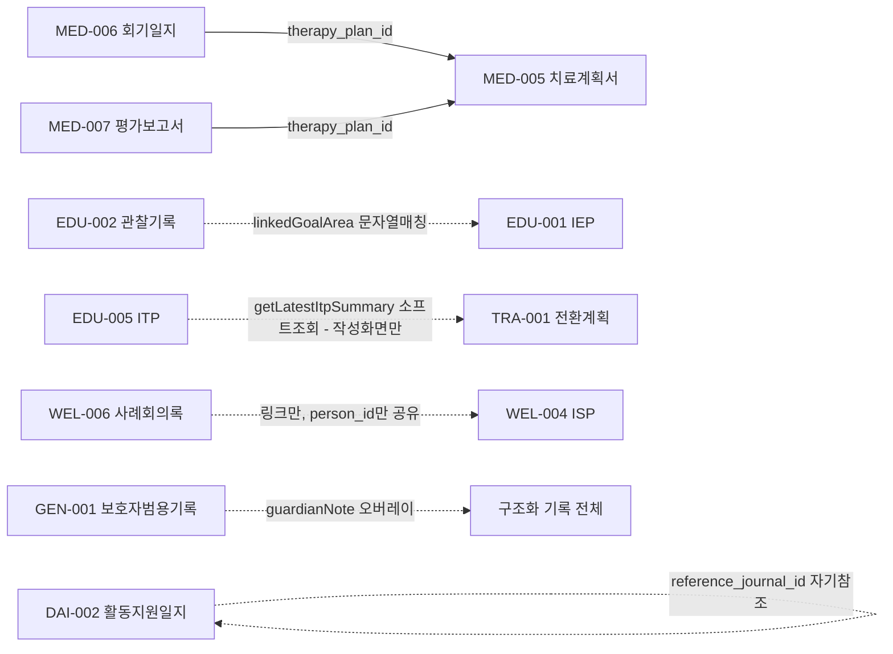

# 기록(record_type) 목록·관계 정리 및 교차 열람 제안

> 작성일: 2026-07-24
> 성격: 사용자 요청으로 작성한 정리·제안 문서. §1~2는 `packages/validation/src/records.ts`(신뢰 소스)와 실제 서버 액션 코드를 근거로 한 사실 정리, §3~4는 그 위에 얹은 의견·제안이다. §1~2는 `01-prd.md` §3-2-2/§3-2-3, `05-erd.md` §3의 내용을 이 문서 목적에 맞게 재구성한 것이라 record_type 자체의 신뢰 소스는 여전히 `01-prd.md`/`05-erd.md`다.

---

## 1. 기록(record_type) 16종 목록

| 분야 | 유형 | 기록명 | 주작성자 | 보조작성자 | 열람가능자 |
|---|---|---|---|---|---|
| DAI | SELF-001 | 자기표현 | 당사자(본인) | 보호자(대리 작성) | 보호자, 활동지원사, 특수교사, 치료사 |
| DAI | DAI-002 | 활동지원 일지 | 활동지원사 | – | 당사자(본인), 보호자, 특수교사, 치료사 |
| EDU | EDU-001 | IEP(개별화교육계획) | 특수교사 | – | 당사자(본인), 보호자 |
| EDU | EDU-002 | 관찰기록 | 특수교사 | – | 당사자(본인), 보호자 |
| EDU | EDU-003 | 행동중재계획(BIP) | 특수교사 | – | 당사자(본인), 보호자 |
| EDU | EDU-005 | 개별화전환계획(ITP) | 특수교사 | – | 당사자(본인), 보호자 |
| MED | MED-005 | 치료계획서 | 치료사 | – | 당사자(본인), 보호자, 활동지원사, 사회복지사 |
| MED | MED-006 | 회기 일지 | 치료사 | – | 당사자(본인), 보호자, 활동지원사, 사회복지사 |
| MED | MED-007 | 평가보고서 | 치료사 | – | 당사자(본인), 보호자, 활동지원사, 사회복지사 |
| WEL | WEL-004 | ISP(개별지원계획) | 사회복지사 | – | 당사자(본인), 보호자 |
| WEL | WEL-005 | 서비스 이용계획 | 사회복지사 | – | 당사자(본인), 보호자 |
| WEL | WEL-006 | 사례회의록 | 사회복지사 | – | 당사자(본인), 보호자 |
| TRA | TRA-001 | 전환계획 | 사회복지사 | 특수교사(청소년기+, TRA 권한 보유 시) | 당사자(본인), 보호자 |
| LEG | LEG-001 | 후견감독보고서(성인기+ 전용) | 사회복지사 | – | 당사자(본인), 보호자 |
| LEG | LEG-002 | 권익옹호 상담기록(성인기+ 전용) | 사회복지사 | – | 당사자(본인), 보호자 |
| 무관 | GEN-001 | 보호자 범용 기록 | 보호자 | – | 당사자(본인, 해당 시) |

보조작성자가 있는 유형은 SELF-001·TRA-001 2개뿐이며, 나머지 14개는 한 역할이 전담 작성한다(`01-prd.md` §3-2-2).

---

## 2. 기록 간 관계 — 유형별 정리

대부분은 서로 독립적이다. 실제 "연결"이라 부를 만한 것은 아래 5가지 패턴으로 나뉜다.

### 2-1. 저장된 참조 (JSONB 안에 다른 레코드 id를 문자열로 저장 — DB 외래키는 아님)

| 관계 | 저장 필드 | 비고 |
|---|---|---|
| MED-006(회기일지) → MED-005(치료계획서) | `content.therapy_plan_id` | 작성 화면 진입 시 자동 연결(수동 선택 불가, `getSessionComposeContext`) |
| MED-007(평가보고서) → MED-005(치료계획서) | `content.therapy_plan_id` | 같은 `therapy_plan_id`를 가진 MED-007끼리 초기/중간/최종 3열 비교 뷰(`getEvalComparison`) 구성 |
| DAI-002(활동지원일지) → DAI-002(자기 자신) | `content.reference_journal_id` | 유일한 자기참조. "이전 일지 불러오기"로 프리필에 사용 |

DB 제약이 아니라 앱 레이어가 쓰기 시점에만 신뢰하는 값이다(JSONB라 애초에 FK 제약 불가).

### 2-2. 느슨한 문자열 매칭 (ID가 아니라 라벨 텍스트로 연결)

- **EDU-002(관찰기록) → EDU-001(IEP)**: `content.linkedGoalArea`가 그 IEP 목표영역 이름과 문자열이 같으면 연결(`getIepDetail`의 `linkedObservations` 파생). IEP 쪽 목표명이 바뀌면 조용히 끊어진다.

### 2-3. 조회 시점마다 다시 찾는 소프트 링크 (저장 필드 없음)

`docs/09-cto-team-gap-analysis.md` G-1이 지적한 "person_id 소프트 링크" 패턴 — 같은 당사자의 다른 record_type 중 최신 것 하나를 매 조회마다 쿼리로 찾아온다.

- **TRA-001(전환계획) 위자드 ← EDU-005(ITP)**: `getLatestItpSummary(personId)`로 학교가 작성한 최신 ITP를 참고 패널에 표시(일방향 — 위자드 작성 화면에서만, 저장 후 상세 조회 화면에는 없음)
- **WEL-004(ISP) ↔ WEL-006(사례회의록)**: 저장된 링크는 없고 `person_id`+도메인만 같음. `IspReviewPane`에 서비스현황(WEL-005)·사례회의록(WEL-006)·타임라인 진입 **링크**만 달려 있다(내용 미리보기는 없음)

### 2-4. 이름은 비슷해도 의도적으로 분리된 "동명이인" 레코드

- **EDU-001의 `content.transition_plan` 서브섹션** ≠ **EDU-005(ITP)** ≠ **TRA-001(전환계획)**: 셋 다 "전환"을 다루지만 작성자·활성 생애주기 구간이 전부 다르다. 현재 이 셋 사이엔 **어떤 연결도 없다**(EDU-005↔TRA-001의 일방향 소프트 링크 제외).
- **MED-006의 `domain_scores`**(고정 키 객체) ≠ **MED-007의 `domain_scores`**(배열): 필드명은 같지만 모양이 달라 재사용 금지로 명시돼 있다.

### 2-5. 데이터 링크는 없지만 같은 가드·허브를 공유

- **LEG-001 ↔ LEG-002**: 성인기·노년기(만 19세+) 연령 가드 공유. `/records/leg`(W-21) 허브 화면이 이미 둘을 함께 목록화한다 — 갭 아님.
- **TRA-001 ↔ EDU-005**: 청소년 전환기를 함께 다루지만 활성 구간이 다르다(TRA-001은 청소년기~성인기, EDU-005는 청소년기 한정).

### 2-6. 전 record_type 횡단 — GEN-001의 "비파괴 편집" 오버레이

GEN-001은 독립된 16번째 유형이면서 동시에, 보호자가 **다른 구조화 기록(GEN-001이 아닌 모든 유형)을 수정할 때** 원본을 덮어쓰지 않고 `content.guardianNote: {title, body, editedAt}` 서브키로 얹는 메모 레이어이기도 하다. 이미 `RecordContentView`에서 렌더링된다.

---

## 3. 현재 이미 구현된 교차 열람 UI (근거: 코드 확인)

작성·제안에 앞서, 이미 되어 있는 것과 안 되어 있는 것을 구분한다.

| 화면 | 이미 있는 교차 열람 |
|---|---|
| `IepReviewPane`(EDU-001 점검) | `linkedObservations` — 연결된 EDU-002 관찰기록을 목록으로 **인라인 임베드**(최대 5건) |
| `ObservationReadView`(EDU-002 상세) | "🎯 연결된 IEP 목표" 라벨 표시(역방향, 텍스트 하나) |
| `IspReviewPane`(WEL-004 점검) | 서비스현황(WEL-005)·사례회의록(WEL-006)·타임라인 **바로가기 링크** 3개(내용 미리보기 없음) |
| `TherapyPlanDetail`(MED-005 상세) | 진행 회기 수(MED-006 파생 통계 1개) + 회기일지 작성·타임라인 링크 |
| `TransitionPlanWizard`(TRA-001 **작성** 화면) | `getLatestItpSummary`로 최신 ITP(EDU-005) 참고 패널 — **작성 시에만**, 제출 후 상세/조회 화면엔 없음 |
| `EvalComparisonTable`(MED-007) | 같은 `therapy_plan_id`의 초기/중간/최종 3건을 **나란히 비교**(가장 정교한 교차 열람 사례) |
| `RecordDetailPane`(범용 상세 뷰) | 관련 기록 섹션 없음 — record_type별 ReadView 각자가 알아서 표시 |

**패턴 스펙트럼**: "링크만"(WEL) < "라벨 하나"(EDU-002) < "목록 임베드"(EDU-001) < "통계 파생값"(MED-005) < "나란히 비교"(MED-007)로, 이미 관계의 성격에 따라 다른 깊이로 구현돼 있다 — 획일적인 "관련 기록 패널"을 억지로 통일하기보다 이 스펙트럼을 유지하는 게 맞다고 본다(§4 참조).

---

## 4. 의견 — 언제 관련 기록을 함께 보여주는 게 좋은가

### 4-1. 판단 기준

관계가 있다고 무조건 같이 보여줄 필요는 없다. 아래 3가지 질문으로 판단하는 것을 제안한다.

1. **작성 시점에 그 정보가 의사결정에 실제로 쓰이는가?** (그렇다면 작성 화면에 임베드)
2. **조회 시점에 "이 기록만 보면 오해할 여지"가 있는가?** (그렇다면 조회 화면에도 임베드해야 함 — 지금 §3에서 빠진 부분)
3. **단순히 다른 화면으로 넘어가는 용도인가?** (그렇다면 링크 하나로 충분, 임베드는 과함)

### 4-2. record_type별 제안

| 관계 | 현재 | 제안 | 근거 |
|---|---|---|---|
| **EDU-005(ITP) ↔ TRA-001** | 작성 화면(TransitionPlanWizard)에만 참고 패널 있음 | **조회 화면에도 동일하게 노출** — `TransitionPlanReadView`에 "참고한 ITP" 요약, `ItpReadView`에 "이 학생의 전환계획(TRA-001) 존재 여부/최근 갱신일" 배지 | 지금은 위자드로 "작성 중"일 때만 보이고, 제출 후 나중에 그 레코드를 다시 열어보는 사회복지사·교사·보호자는 상대 기록의 존재조차 알 수 없다. 관계 자체(§2-3)는 이미 만들어져 있으니 **작성 화면의 코드를 조회 화면에도 재사용**하면 되는, 비용 대비 효과가 가장 큰 항목 |
| **EDU-001/EDU-005/TRA-001 "전환" 3형제** | 서로 완전히 분리, 연결 없음(EDU-005→TRA-001 제외) | **새로운 데이터 링크는 만들지 말고, 셋이 동시에 존재하는 당사자에 한해 작은 안내 배지만 추가**(예: "이 학생은 IEP 전환섹션·ITP·전환계획 3종을 모두 갖고 있습니다 — 헷갈리지 않게 각 문서의 목적을 확인하세요" 같은 1회성 툴팁) | 이름이 비슷해 혼동 위험이 실제로 있지만(§2-4), 이건 데이터를 연결할 문제가 아니라 **사용자 교육/UI 레이블링 문제**다. 억지로 링크를 만들면 오히려 "이 셋이 같은 것"이라는 잘못된 인상을 줄 수 있음 |
| **WEL-004 ↔ WEL-006** | 링크만(내용 미리보기 없음) | 링크를 유지하되, **"최근 사례회의록 1건 미리보기"**(제목·날짜 한 줄) 정도만 링크 위에 얹기 | ISP 점검 중인 사회복지사가 "최근에 사례회의가 있었는지"를 클릭 없이 바로 알면 유용하지만, 전체 내용까지 끌어올 필요는 없다 — MED-005의 "통계 파생값" 수준이 적당 |
| **MED-005 ↔ MED-006** | 진행 회기 수(통계)만 | **최근 회기 2~3건 제목·날짜 미리보기 추가**(선택) | 이미 "회기 몇 회"는 보이는데 "최근에 뭘 했는지"는 안 보여서, 치료사가 계획서를 다시 열어볼 때 링크를 눌러야만 알 수 있음. 우선순위는 낮음(현재도 불편함이 크게 보고된 적 없음) |
| **LEG-001 ↔ LEG-002** | `/records/leg` 허브가 이미 함께 목록화 | **변경 불필요** | 이미 충분함 |
| **GEN-001 guardianNote** | 이미 각 ReadView에 렌더링됨 | **변경 불필요** | 이미 충분함 |
| **DAI-002 자기참조** | 작성 시 프리필만 | 조회 화면(`JournalReadView`)에 "이 일지는 M월D일 일지를 참고해 작성됨" 한 줄 추가 | 사소하지만 감사(audit) 관점에서 어떤 일지를 참고했는지 사후에 확인 가능하면 좋음. 우선순위 낮음 |

### 4-3. 하지 말아야 할 것

- **범용 "관련 기록 패널" 컴포넌트를 지금 미리 만드는 것**: `docs/09-cto-team-gap-analysis.md`가 이미 "person_id 소프트 링크 패턴 3곳은 지금 추상화하지 않는다(YAGNI, 4번째 사례 시 재논의)"고 CTO팀 합의로 결정해둔 바 있다. 이번 §4-2 제안(주로 EDU-005↔TRA-001)까지 반영해도 패턴은 여전히 소수(3~4곳)이고 화면마다 필요한 깊이(링크/배지/임베드/비교표)가 달라서, 지금 공통 컴포넌트로 묶으면 오히려 그 다양성을 억지로 획일화하게 된다. **각 화면에 맞는 얕은 구현을 유지**하고, 정말로 5번째·6번째 사례가 생겨 반복이 뚜렷해질 때 추출을 재논의하는 게 맞다고 본다.
- **관계가 약한 곳(§2-4, §2-5)에 억지로 데이터 링크를 새로 만드는 것**: 특히 EDU-001/EDU-005/TRA-001 "전환 3형제"는 이름이 비슷하다고 억지로 서로 참조시키면, "이 셋이 사실 하나의 흐름"이라는 잘못된 멘탈 모델을 사용자에게 심어줄 위험이 있다. 여긴 UI 레이블링·안내 문구로 푸는 게 맞다.

### 4-4. 우선순위 제안 (실행한다면)

1. **EDU-005 ↔ TRA-001 조회 화면 노출** — 이미 있는 로직 재사용이라 비용 대비 효과 최대
2. **WEL-004 ↔ WEL-006 미리보기 한 줄 추가** — 두 번째로 저비용
3. 나머지(MED 미리보기, DAI-002 출처 표시, 전환 3형제 안내 배지)는 선택 사항, 필요 요청 시 진행

---

*이 문서는 사용자 요청으로 작성한 정리·제안 문서다. §1~2 record_type 정의의 신뢰 소스는 여전히 `01-prd.md`/`05-erd.md`이며, 실제 구현에 착수하면 이 문서의 §4 제안 내용을 갱신할 것.*
